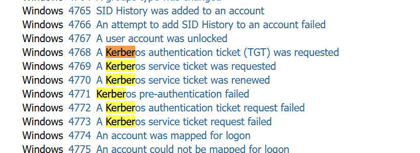
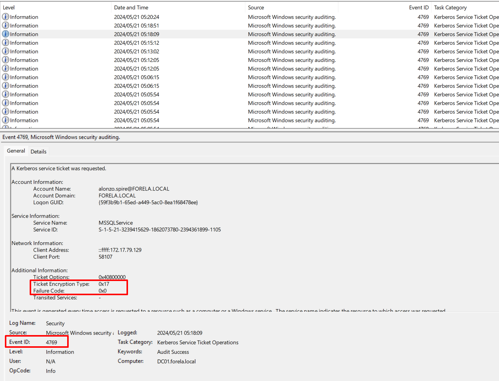
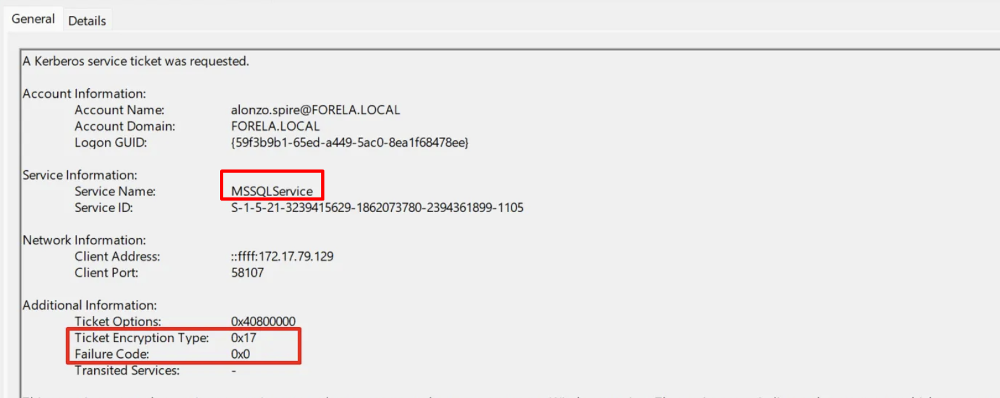
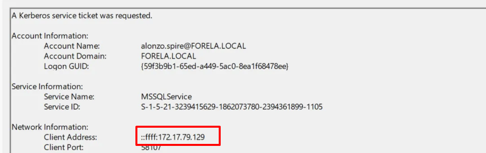
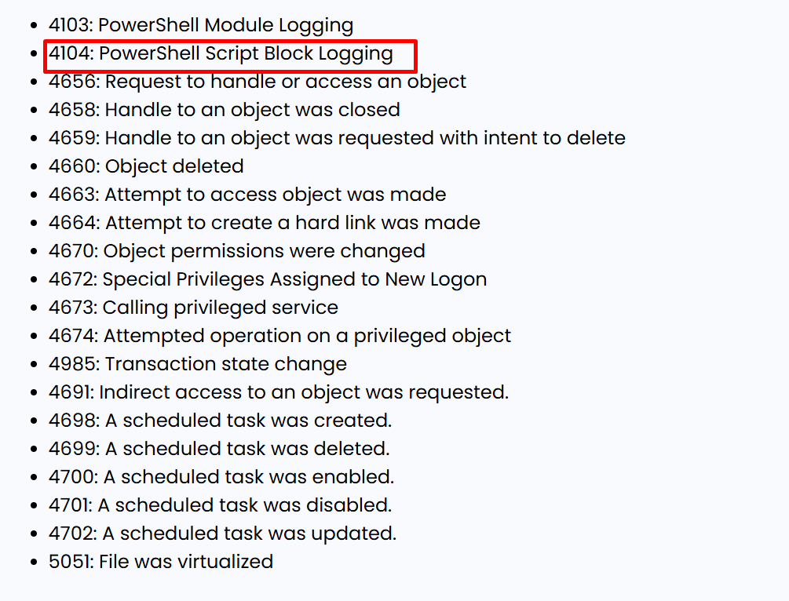
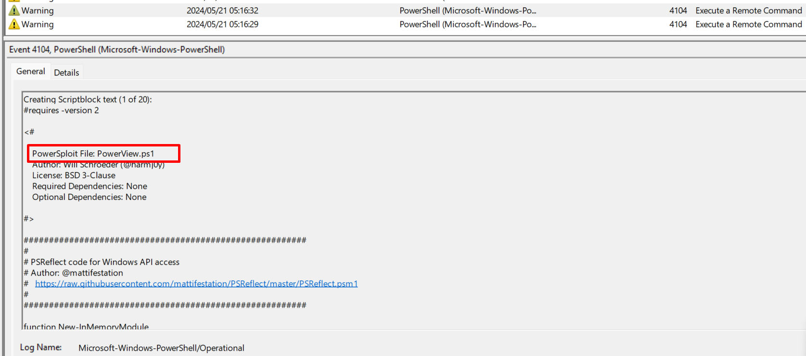
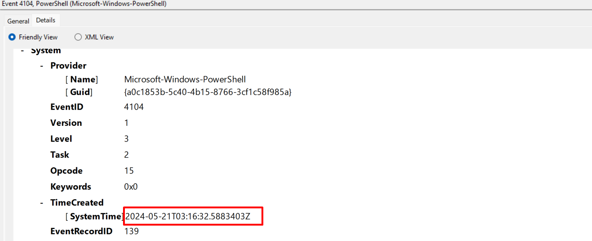
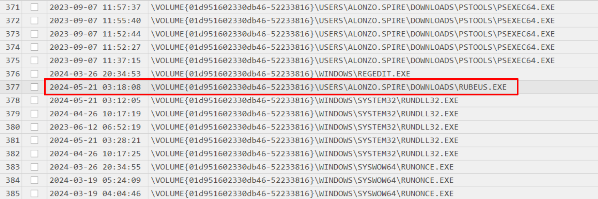

# Introduction
### Communication from client

```python
A user named Alonzo noticed suspicious files on his computer and promptly notified the newly formed SOC team. 
Based on initial assessment, a Kerberoasting attack is suspected within the network. You are tasked to validate these findings by analysing the provided evidence.
```

### Provided Evidence

We have the following artefacts from the environment:

1. **Domain Controller Security Logs** (`Security.evtx`)
2. **PowerShell Operational Logs** from the affected workstation (`Microsoft-Windows-PowerShell%4Operational.evtx`)
3. **Prefetch files** (`.pf`) from the affected workstation

# Investigation

When working with Windows security logs, a useful reference is the [Ultimate Windows Security Log Encyclopedia](https://www.ultimatewindowssecurity.com/securitylog/encyclopedia/), where you can search for specific event IDs like those related to Kerberos.

For larger datasets, tools like **Chainsaw**, **Splunk**, or **SilkETW** dramatically speed up analysis. However, since our log files are relatively small, manual inspection using **Event Viewer** is perfectly viable – and it gives us direct access to the raw event details.

## Task 1: Confirm the Kerberoasting Timestamp

**Question:** Confirm the UTC date and time when the kerberoasting activity occurred.

**Answer:** `2024-05-21 03:18:09`

1. Open the Domain Controller’s `Security.evtx` log in Event Viewer.
2. Filter for **Event ID 4769** (A Kerberos service ticket was requested).
3. Exclude tickets for the `krbtgt` account and any machine account (names ending with `$`).
4. Look for the following indicators of a Kerberoasting attack:
    - **Ticket Encryption Type:** `0x17` (RC4-HMAC) or `0x18` (AES256-CTS-HMAC-SHA1-96) – RC4 is a strong red flag.
    - **Failure Code:** `0x0` (successful ticket request) – the attacker would have received a ticket to crack offline.

The first event matching all these criteria reveals the exact time in local system time. Convert to UTC to obtain the final answer.


Figure 1: Kerberoast Event IDs



Figure 2: Kerberoast Hunting


## Task 2: Identify the Targeted Service

**Question:** What is the Service Name that was targeted?

**Answer:** `MSSQLService`

In the same Event 4769, the `Service Name` field shows which service’s ticket was requested. The attacker targeted a service account associated with SQL Server.


Figure 3: Kerberoast Service Name


## Task 3: Identify the Source Workstation IP

**Question:** What is the IP Address of the workstation from which the attack originated?

**Answer:** `172.17.79.129`

The client IP address is recorded directly in the `Client Address` field of the same 4769 event.


Figure 4: Client Address IP

## Task 4: Identify the Enumeration Script

**Question:** Now that we have identified the workstation, we need to triage the endpoint using the provided PowerShell logs and Prefetch files. What is the name of the file used to enumerate Active Directory objects and potentially locate Kerberoastable accounts?

**Answer:** `powerview.ps1`

PowerShell logs often hold the key. Relevant event IDs to monitor (see [Critical Windows Event IDs to Monitor](https://graylog.org/post/critical-windows-event-ids-to-monitor/)) include **4104** – Script block logging.

1. Open the PowerShell Operational log.
2. Filter for **Event ID 4104**.
3. Inspect the script block text in the details pane. You will find a script name and its contents. Here, `powerview.ps1` is clearly present, a well-known tool for AD enumeration and finding Kerberoastable users.


Figure 5: Windows Event IDs



Figure 6: Powersploit

## Task 5: Script Execution Time

**Question:** When was this script executed? (UTC)

**Answer:** `2024-05-21 03:16:32`

In the same event, scroll to the **Details** tab (or `EventData`). The `Created` system time gives the execution timestamp. Convert to UTC if necessary.


Figure 7: Script UTC Time


## Task 6: Identify the Credential Dumping Tool

**Question:** What is the full path of the tool used to perform the actual kerberoasting attack?

**Answer:** `C:\\Users\\Alonzo.spire\\Downloads\\Rubeus.exe`

Prefetch files (`.pf`) are Windows artefacts created the first time an executable runs, and updated on subsequent executions. They are excellent for tracking program execution.

Since the files are binary-encoded, we need to parse them. Use **Eric Zimmerman’s PECmd** tool:

```bash
PECmd.exe -d "C:\\Path\\to\\PrefetchArtifacts" --csv . --csvf result.csv
```

This generates a CSV file containing all prefetch metadata. Open it with Excel or, better, use **Timeline Explorer** (also by Eric Zimmerman) for efficient timeline analysis.

Filtering for `.exe` entries, we quickly spot `RUBEUS.EXE` executed from Alonzo’s Downloads folder. Rubeus is a popular tool for Kerberoasting attacks.


Figure 8: Prefetch logs

## Task 7: Execution Time of the Dumping Tool

**Question:** When was the tool executed to dump credentials?

**Answer:** `2024-05-21 03:18:08`

The same prefetch entry provides a last-run timestamp. After converting to UTC, we see it matches the suspicious ticket request time (Task 1) within one second, confirming the sequence of events: enumeration (PowerView) → kerberoasting (Rubeus) → ticket request logged on the DC.

# Summary

Using a combination of Domain Controller security logs, PowerShell script block logging, and Prefetch file analysis, we successfully:

- Pinpointed the exact time a Kerberoasting attack occurred.
- Identified the targeted service (`MSSQLService`).
- Traced the attack to workstation `172.17.79.129`.
- Discovered the attacker used `powerview.ps1` for enumeration and `Rubeus.exe` for the ticket extraction.
- Reconstructed the attack timeline with second-level accuracy.

This investigation highlights the importance of enabling advanced logging (like PowerShell Module/Script Block logging) and collecting endpoint artefacts such as Prefetch files to swiftly confirm and understand intrusion activity.