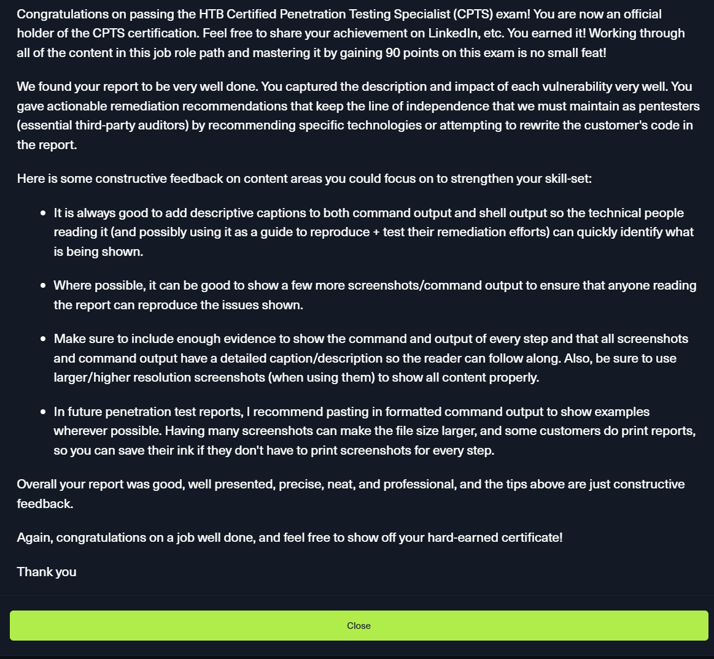

*Note: I will provide the unredacted copy upon request*

### Review

This wasn’t a “collect another badge” kind of experience. CPTS is Hack The Box’s most demanding Job Role Path, and it absolutely lives up to that reputation. Twenty-eight modules deep — far more than most HTB paths — it’s designed to test not only your technical ability, but your patience (patience not to break that keyboard), discipline, and mindset. This path doesn’t rush you; it *forges* you.

A few modules stood out so strongly that I still revisit them through my own notes:

- **Getting Started**
    This module deserves special praise. It doesn’t just introduce concepts — it establishes a mindset. A clean, reusable methodology for approaching *any* target. Simple, elegant, and insanely effective. I still treat it as my personal playbook.
    
- **Footprinting**
    This is where fundamentals become powerful. It walks through common services, how they behave, how attackers abuse them, and just as importantly, how defenders should lock them down. Practical, essential, and beautifully structured.
    
- **Active Directory Enumeration & Attacks**
    This one was relentless — but in the best way possible. From Kerberoasting and ticket attacks to trust relationships, group policies, lateral movement, and full engagement setup, it left nothing unexplored. Even external enumeration strategies were covered. Easily one of the most valuable learning experiences I’ve had. Pure gold.
    
### Knowledge domains

HTB Certified Penetration Testing Specialist (HTB CPTS) evaluates the candidates’ knowledge on the following:
+ Penetration testing processes and methodologies
+ Information gathering & reconnaissance techniques
+ Attacking Windows & Linux targets
+ Active Directory penetration testing
+ Web application penetration testing
+ Manual & automated exploitation
+ Vulnerability assessment
+ Pivoting & Lateral Movement
+ Post-exploitation enumeration
+ Windows & Linux Privilege escalation
+ Vulnerability/Risk communication and reporting

### Tips

While the content quality is outstanding, I’ll be honest — things *do* break. Labs fail. Tools misbehave. Systems need resets. But that’s part of the lesson. If you’re stepping into pentesting or red teaming, frustration is not a bug — it’s a feature (well…). CPTS even addresses this head-on with a dedicated **Learning Process** module focused on mental resilience. That alone says a lot. Have alternative tools to whatever concept or vulnerability that you want to abuse

if all you did the CPTS path in less than 2 months then you should be ready to take the exam as they often say on HTB discord server. But If you are anything like me who does not have time and can barely spend 1.5 hour a day to hacking at most, spent a year or more to complete the path, you may be feeling like you need some extra practice. Here are some options, let's see:

+ HTB Labs now has a preparation track which you could give a go, https://app.hackthebox.com/tracks/76
+ Pair that with a Pro Lab for the network pivoting component to practice on as well, then you should be alright. 
+ There is also the unofficial CPTS Prep from ippsec https://www.youtube.com/watch?v=H9FcE_FMZio&list=PLidcsTyj9JXItWpbRtTg6aDEj10_F17x5
+ and the TJNull curated list https://docs.google.com/spreadsheets/u/1/d/1dwSMIAPIam0PuRBkCiDI88pU3yzrqqHkDtBngUHNCw8/htmlview?pli=1

### Tools
These below would have made my life easier or made my life easier during this exam:
+ I had used the word template they provide for the report, honestly, use SysReptor.
+ Flameshot here is the best I have encountered so far for screenshots, and was very handy, the auto numbering is a great feature, here https://flameshot.org/
+ C2 is not introduced as yet, it seems to be overkill for such a small network, so a shell handler such as Penelope is great to have, here https://github.com/brightio/penelope
+ A note taking app, I use notion (it's free), however, we could just use SysReptor for notes as well

The CPTS is honestly Hard — I had two month  break after that exam (Traumatized T-T) . I was emotionally, physically (not enough sleep) and mentally beaten.

**February 2025** — What started as a brutal uphill battle finally paid off. I’ve officially earned the **Certified Penetration Testing Specialist (CPTS)** certification, and yes… it feels surreal to say that out loud.

### Examiner Feedback

