# Scenario

You are vying for a junior DFIR consultant role at Forela-Security, a respected cybersecurity consultancy. As part of the technical assessment, you've been handed a set of Windows event logs. A user named `Cyberjunkie` is suspected of malicious activity. Your task: analyze the logs, extract key evidence, and report your findings. This challenge mirrors real-world incident response duties, testing your knowledge of Windows Event IDs and your ability to identify and interpret security-relevant events.

# Investigation

## Task 1: When did the cyberjunkie user first successfully log into his computer? (UTC)

**Answer:** `27/03/2023 14:37:09` (27 March 2023 14:37:09 UTC)

A successful logon is recorded as Event ID 4624. By filtering the Security log for this ID and the target username `Cyberjunkie`, we locate the earliest event.

> *Reference:*
> 
> 
> [Ultimate Windows Security Encyclopedia – Event ID 4624](https://www.ultimatewindowssecurity.com/securitylog/encyclopedia/)
> 

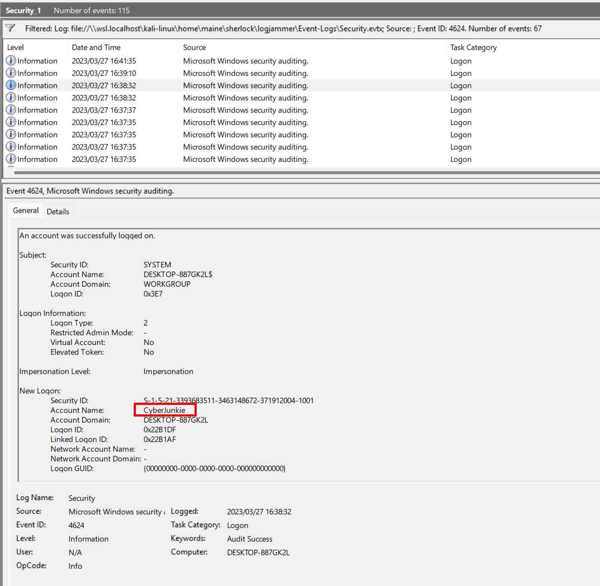

*Figure 1: Filtered Event ID 4624 showing the first logon time.*

The event’s timestamp was converted to UTC (the logs were in local time; adjustment applied) yielding **27/03/2023 14:37:09**.

*(Alternative methods: `chainsaw` or command-line string searching, but Event ID filtering promotes better understanding.)*

## Task 2: The user tampered with firewall settings on the system. Analyze the firewall event logs to find out the Name of the firewall rule added?

**Answer:** `Metasploit C2 Bypass`

Firewall rule additions are typically logged under Event ID 2004 (Windows Firewall with Advanced Security). While Event ID 4946 can also indicate a rule change, direct inspection of the firewall operational log quickly surfaced a 2004 event containing the new rule’s details.

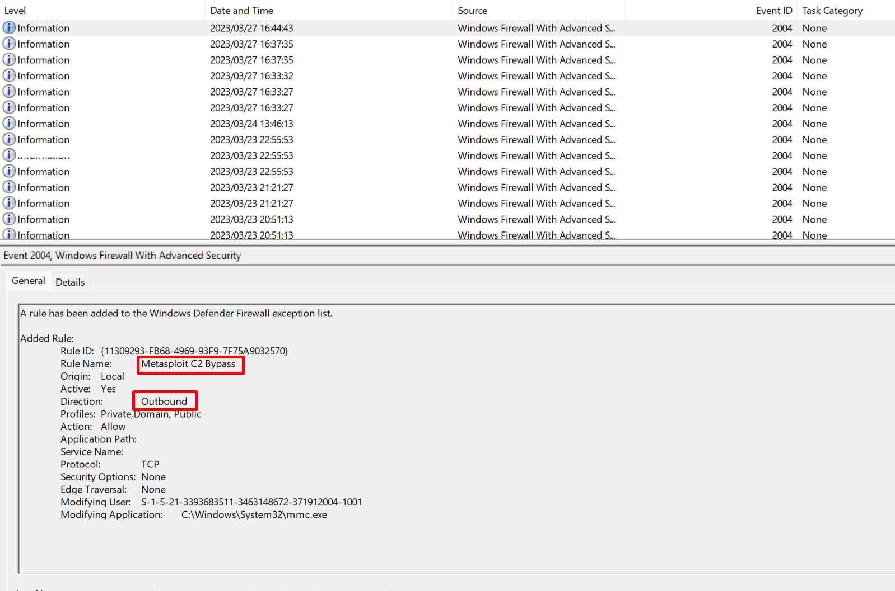
*Figure 2: Event ID 2004 exposing the newly added firewall rule name.*

## Task 3: Whats the direction of the firewall rule?

**Answer:** `Outbound`

In the same Event ID 2004 log entry, the `Direction` field explicitly states `Outbound`. This indicates the rule governs traffic leaving the host, aligning with a potential C2 callback.

## Task 4: The user changed audit policy of the computer. Whats the Subcategory of this changed policy?

**Answer:** `Other Object Access Events`

Audit policy changes generate Event ID 4719 in the Security log. Filtering for this event reveals the modified subcategory.

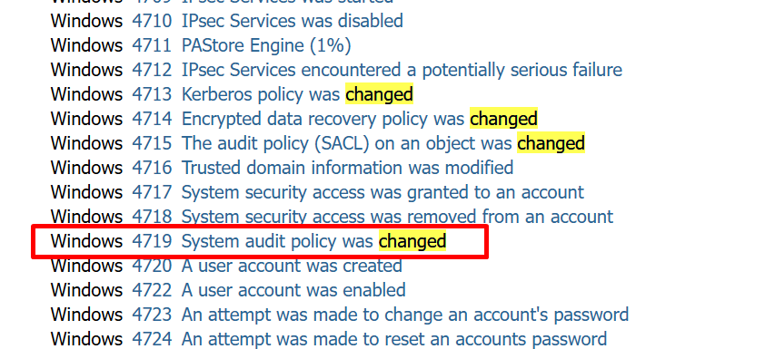

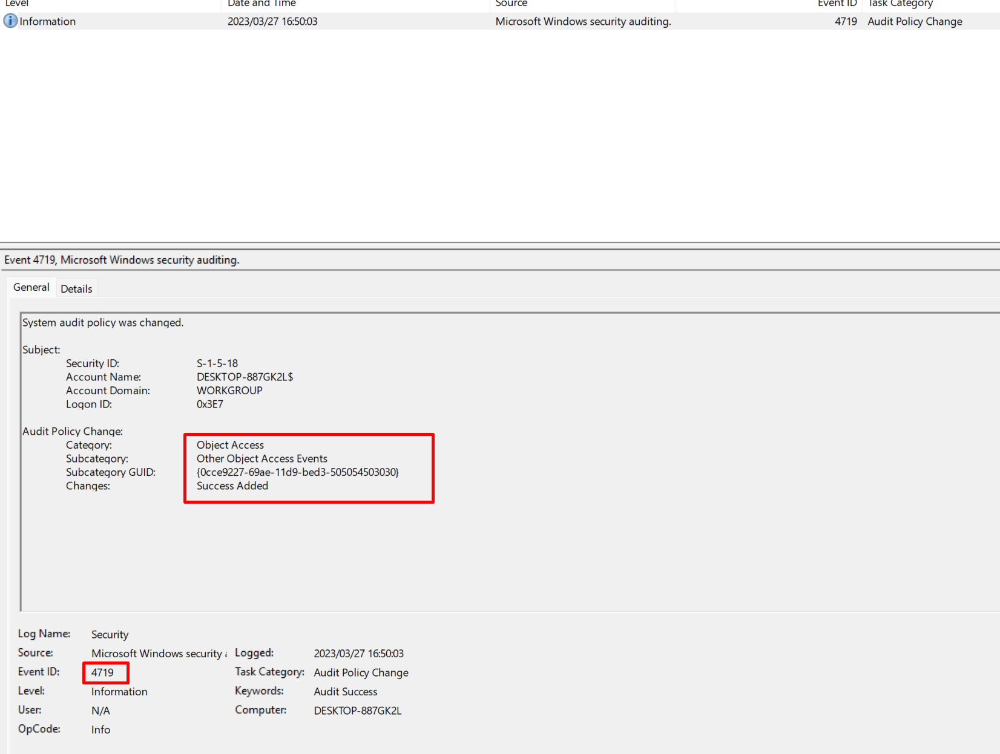

*Figures 3 & 4: Event ID 4719 with the policy change details and the subcategory highlighted.*

The `Subcategory` field reads `Other Object Access Events`, indicating an attempt to manipulate object-level auditing, possibly to hide malicious actions.

## Task 5: The user `cyberjunkie` created a scheduled task. Whats the name of this task?

**Answer:** `HTB-AUTOMATION`

Task creation events correspond to Event ID 4698 in the Security log. Filtering by this ID and user context yields the task name.

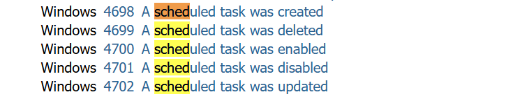
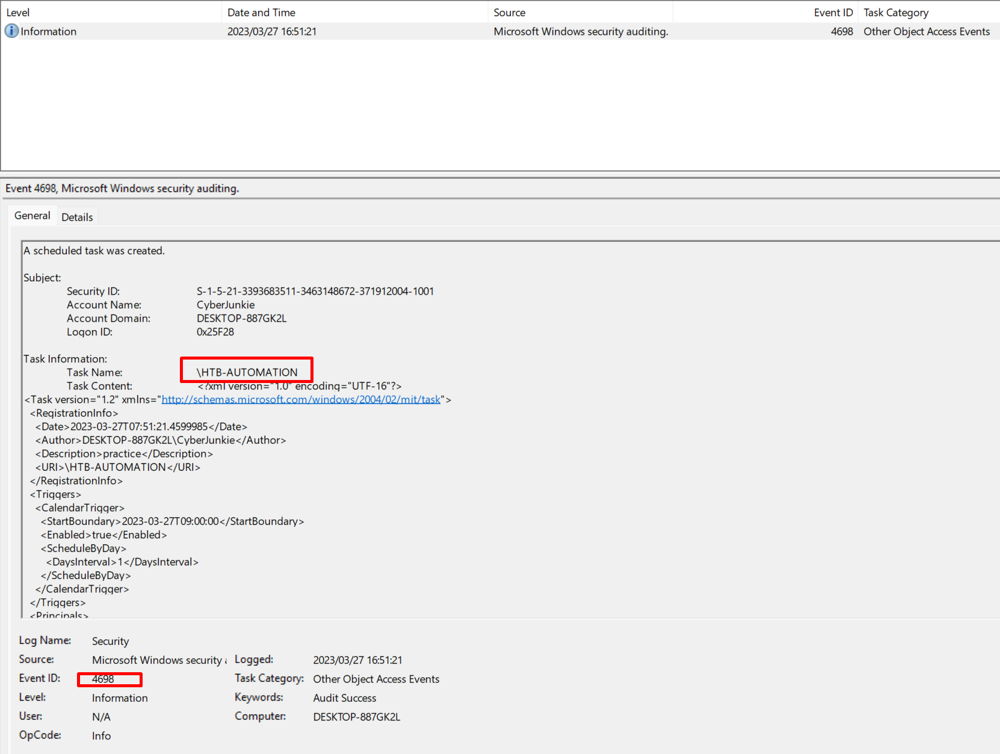
*Figure 5: Event ID 4698 showing the scheduled task creation.*

The `Task Name` field displays `HTB-AUTOMATION`.

## Task 6: Whats the full path of the file which was scheduled for the task?

**Answer:** `C:\\Users\\CyberJunkie\\Desktop\\Automation-HTB.ps1`

Still within the same 4698 event, scrolling down reveals the `Action` section, containing the full command: the executed script path.

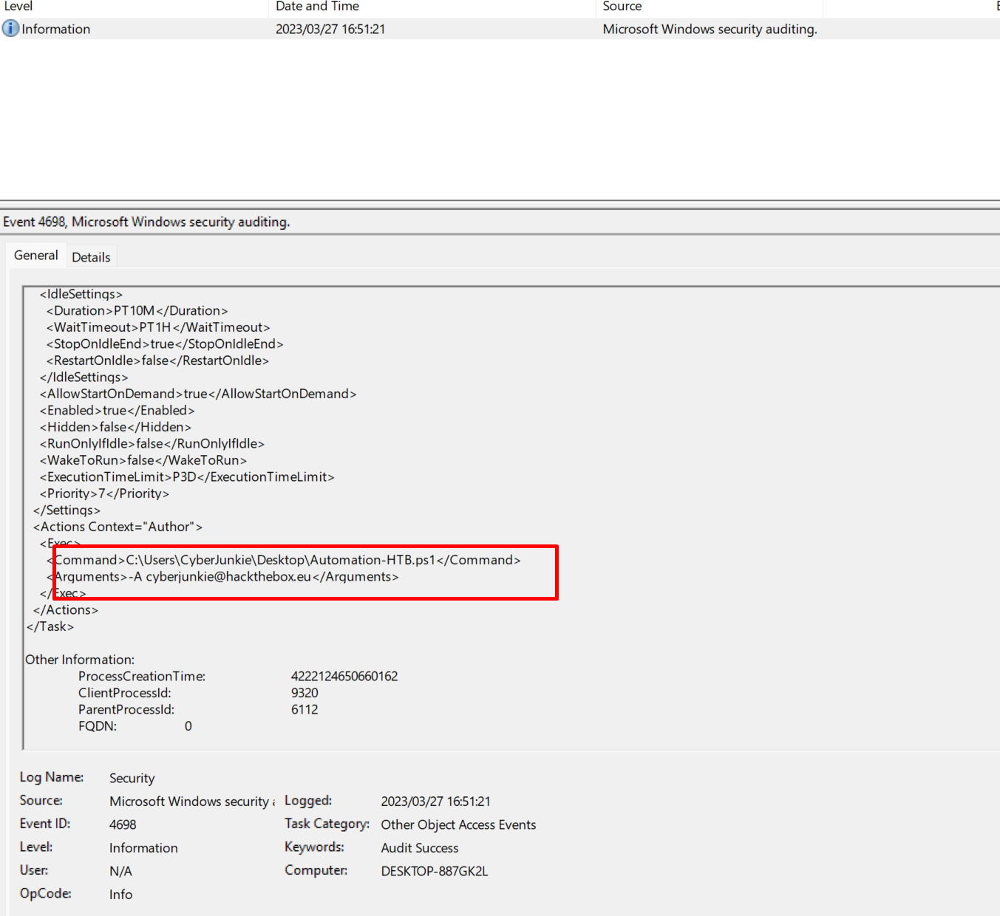
*Figure 6: The command/arguments of the scheduled task, showing the PowerShell script path.*

## Task 7: What are the arguments of the command?

**Answer:** `-A cyberjunkie@hackthebox.eu`

Adjacent to the file path, the same log entry includes the argument string passed to the script. The `Arguments` field contains `-A cyberjunkie@hackthebox.eu`.

## Task 8: The antivirus running on the system identified a threat and performed actions on it. Which tool was identified as malware by antivirus?

**Answer:** `Sharphound`

Windows Defender detections are logged in the `Windows Defender` operational log. Browsing warning events (e.g., Event ID 1116) uncovered an alert related to `SharpHound`, a common Active Directory data collection tool.

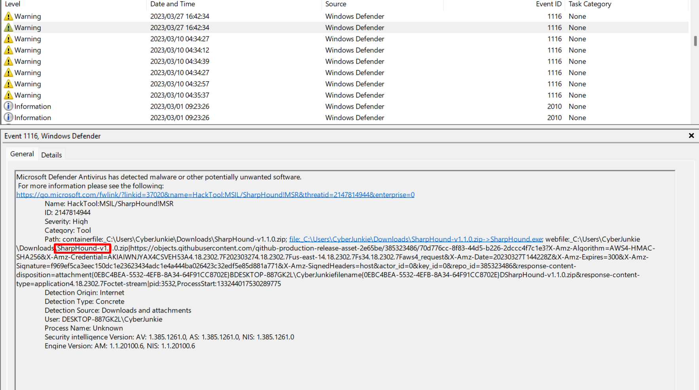
*Figure 7: Windows Defender alert identifying SharpHound.*

## Task 9: Whats the full path of the malware which raised the alert?

**Answer:** `C:\\Users\\CyberJunkie\\Downloads\\SharpHound-v1.1.0.zip`

The same Windows Defender log entry provides the file path under `Resource` or `Path`. This confirms the location of the suspicious ZIP archive.

## Task 10: What action was taken by the antivirus?

**Answer:** `Quarantine`

Windows Defender logs remediation actions with Event ID 1117. Filtering for this ID shows the malware was quarantined, preventing execution.

> *Reference:* [Critical Windows Event IDs to Monitor – Graylog](https://graylog.org/post/critical-windows-event-ids-to-monitor/)
> 

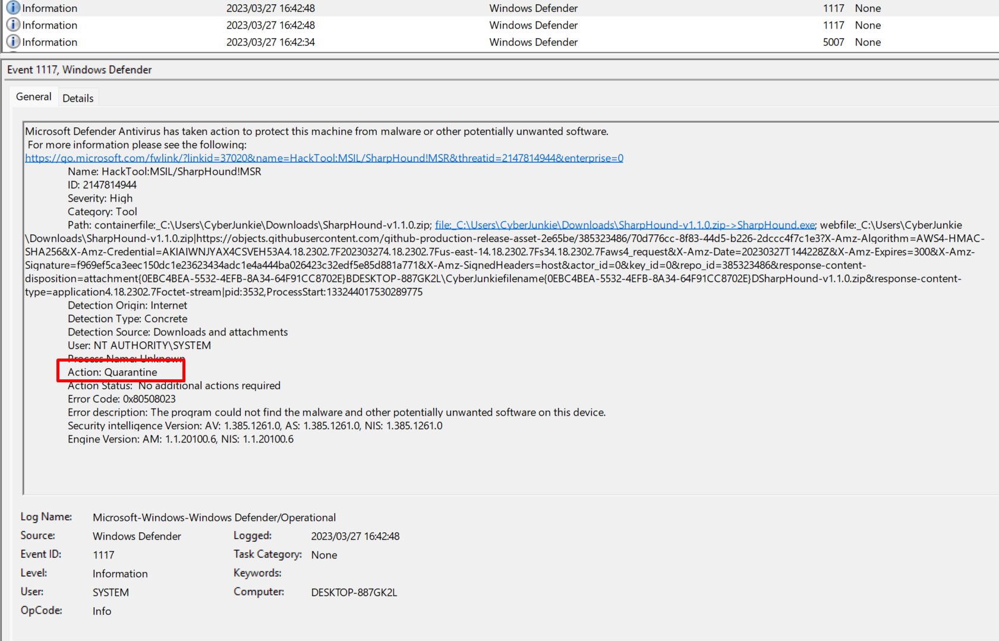
*Figure 8: Event ID 1117 showing the quarantine action.*

## Task 11: The user used Powershell to execute commands. What command was executed by the user?

**Answer:** `Get-FileHash -Algorithm md5 .\\Desktop\\Automation-HTB.ps1`

PowerShell script block logging (Event ID 4104) records the exact commands run. Filtering for this event reveals the user calculated an MD5 hash of the previously scheduled script—possibly to verify file integrity before exfiltration or execution.

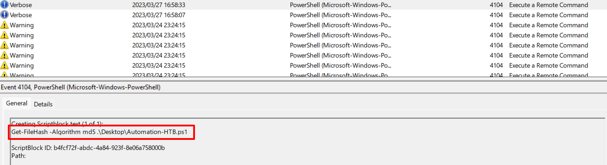
*Figure 9: Event ID 4104 displaying the PowerShell command.*

## Task 12: Cleared Event Log File

**Answer:** `Microsoft-Windows-Windows Firewall With Advanced Security/Firewall`

Clearing an event log generates an event with Category "Log clear" (often Event ID 1102 in the Security log, but for other logs the Event ID may differ). By searching for log clear events, we identified that the `Microsoft-Windows-Windows Firewall With Advanced Security/Firewall` log was wiped, presumably to cover firewall tampering.

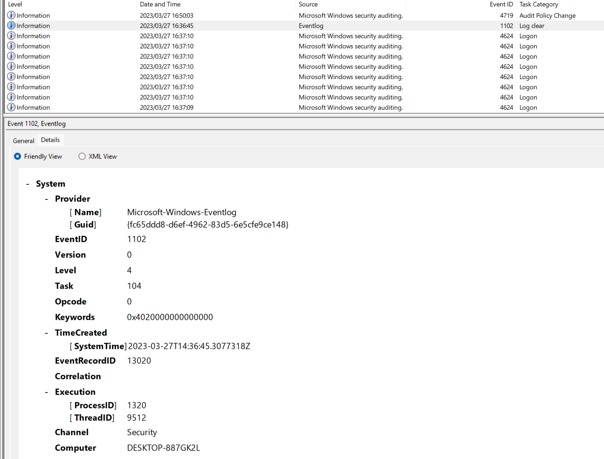
*Figure 10: Event showing a cleared log file, indicating antiforensic activity.*

# Summary of Findings

The `Cyberjunkie` user account:

- Logged in successfully on 27 March 2023 at 14:37:09 UTC.
- Added an outbound firewall rule named `Metasploit C2 Bypass`.
- Modified the audit policy subcategory to `Other Object Access Events`, potentially to silence auditing.
- Created a scheduled task `HTB-AUTOMATION` executing `C:\\Users\\CyberJunkie\\Desktop\\Automation-HTB.ps1` with arguments `A cyberjunkie@hackthebox.eu`.
- Downloaded `SharpHound-v1.1.0.zip`, which was quarantined by Windows Defender.
- Ran a PowerShell `Get-FileHash` command against the same script.
- Attempted to cover tracks by clearing the `Microsoft-Windows-Windows Firewall With Advanced Security/Firewall` log.

This chain of events demonstrates a deliberate attempt to establish persistence, bypass defenses, and harvest Active Directory data—classic steps of a simulated red-team exercise. The analysis successfully validates the candidate’s capability in Windows event log forensics.