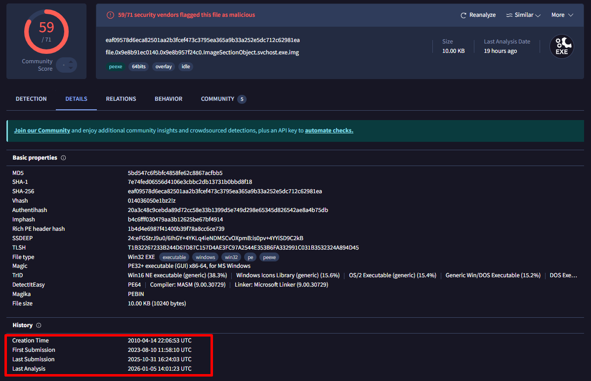

# Scenario

```python
A SIEM generated multiple alerts in less than a minute, all pointing to potential command-and-control (C2) traffic originating from Simon Stark’s workstation. 
Simon reported no unusual behaviour, so the IT team asked him to share screenshots of Task Manager. No suspicious processes were visible, yet the alerts continued.

The SOC manager immediately ordered containment of the workstation and a full memory dump for analysis. 
As the memory forensics specialist, we are tasked with helping the Forela SOC team identify the malicious activity, extract indicators of compromise, and determine the scope of the incident.
```
# Investigation
## Task 1: Please identify the malicious process and confirm process id of malicious process.

**Answer:** `6812`

First, we confirm the operating system details using Volatility 3’s `windows.info` plugin:

```
$ vol -f ./RogueOne/20230810.mem windows.info
Volatility 3 Framework 2.26.2
Progress:  100.00   PDB scanning finished

Variable                      Value
Kernel Base                   0xf80178400000
DTB                           0x16a000
...
Is64Bit                       True
Major/Minor                   15.19041
SystemTime                    2023-08-10 11:32:00+00:00
NtSystemRoot                  C:\\WINDOWS
NtProductType                 NtProductWinNt
NtMajorVersion                10
...
PE TimeDateStamp              Mon Nov 24 23:45:00 2070
```

The system is a 64-bit Windows 10 build 19041.

Rather than walking the full process tree, we use `windows.malfind` to quickly spot processes with injected or suspicious memory regions:

```
$ vol -f ./RogueOne/20230810.mem windows.malfind
...
6812    svchost.exe     0x1b0000        0x1e1fff        VadS    PAGE_EXECUTE_READWRITE  50      1       Disabled
MZ header: 4d 5a 41 52 55 48 89 e5 48 83 ec 20 ...
...
```

The process `svchost.exe` (PID 6812) has a memory region marked `PAGE_EXECUTE_READWRITE` (non-standard for a legitimate `svchost.exe`) and an MZ header indicating executable code injection. This is a strong indicator of compromise.

## Task 2: The SOC team believe the malicious process may spawned another process which enabled threat actor to execute commands. What is the process ID of that child process?

**Answer:** `4364`

We inspect the process tree using `windows.pstree` and grep for the parent PID:

```
$ vol -f ./RogueOne/20230810.mem windows.pstree | grep 6812
*** 6812        7436    svchost.exe     0x9e8b87762080  3    ... 2023-08-10 11:30:03.000000 UTC
     \\Device\\HarddiskVolume3\\Users\\simon.stark\\Downloads\\svchost.exe
**** 4364       6812    cmd.exe         0x9e8b8b6ef080  1    ... 2023-08-10 11:30:57.000000 UTC
     \\Device\\HarddiskVolume3\\Windows\\System32\\cmd.exe
```

The malicious `svchost.exe` (PID 6812) created a child process `cmd.exe` (PID 4364), a common technique for interactive command execution by the attacker.

## Task 3: The reverse engineering team need the malicious file sample to analyze. Your SOC manager instructed you to find the hash of the file and then forward the sample to reverse engineering team. Whats the md5 hash of the malicious file?

**Answer:** `5bd547c6f5bfc4858fe62c8867acfbb5`

To recover the executable for reverse engineering, we dump the process image using `windows.dumpfiles` with the PID:

```
$ vol -f ./RogueOne/20230810.mem windows.dumpfiles --pid 6812
...
ImageSectionObject   0x9e8b91ec0140  svchost.exe
  file.0x9e8b91ec0140.0x9e8b957f24c0.ImageSectionObject.svchost.exe.img
...
```

Now compute the MD5 hash of the dumped file:

```
$ md5sum file.0x9e8b91ec0140.0x9e8b957f24c0.ImageSectionObject.svchost.exe.img
5bd547c6f5bfc4858fe62c8867acfbb5  file.0x9e8b91ec0140.0x9e8b957f24c0.ImageSectionObject.svchost.exe.img
```

Note: The file name `svchost.exe` (notice the missing “s”) and its location in `C:\\Users\\simon.stark\\Downloads` already raise suspicion before any in-depth analysis.


## Task 4: In order to find the scope of the incident, the SOC manager has deployed a threat hunting team to sweep across the environment for any indicator of compromise. It would be a great help to the team if you are able to confirm the C2 IP address and ports so our team can utilise these in their sweep.

**Answer:** `13.127.155.166:8888`

We query network connections from the memory image, filtering for the malicious process:

```
$ vol -f ./RogueOne/20230810.mem windows.netscan | grep 6812
0x9e8b8cb58010  TCPv4  172.17.79.131:64254  -> 13.127.155.166:8888  ESTABLISHED  6812  svchost.exe  2023-08-10 11:30:03.000000 UTC
```

The connection is active, confirming that the malware established a TCP session to `13.127.155.166` on port `8888`. This IP:port pair should be used in threat hunting across the environment.


## Task 5: We need a timeline to help us scope out the incident and help the wider DFIR team to perform root cause analysis. Can you confirm time the process was executed and C2 channel was established?

**Answer:** `10/08/2023 11:30:03 UTC`

Both the `pstree` and `netscan` output show the same timestamp for the process start and the network connection: `2023-08-10 11:30:03`. This suggests that C2 communication began immediately upon execution.


## Task 6: What is the memory offset of the malicious process?

**Answer:** `0x9e8b87762080`

The `pstree` output includes the `EPROCESS` virtual address (offset) in the third column:

```
*** 6812        7436    svchost.exe     0x9e8b87762080  3    ...
```


## Task 7: You successfully analyzed a memory dump and received praise from your manager. The following day, your manager requests an update on the malicious file. You check VirusTotal and find that the file has already been uploaded, likely by the reverse engineering team. Your task is to determine when the sample was first submitted to VirusTotal.

**Answer:** `10/08/2023 11:58:10`

Search VirusTotal for the MD5 hash `5bd547c6f5bfc4858fe62c8867acfbb5`. The file’s first submission timestamp is `2023-08-10 11:58:10 UTC` – roughly 28 minutes after the initial C2 communication, indicating rapid threat intelligence sharing or an automated upload by the attacker or security tools.



# Summary of Findings

| Indicator | Value |
| --- | --- |
| Malicious Process (PID) | `svchost.exe` (6812) |
| Child Process (PID) | `cmd.exe` (4364) |
| Malicious File MD5 | `5bd547c6f5bfc4858fe62c8867acfbb5` |
| C2 IP:Port | `13.127.155.166:8888` |
| Timestamp of Execution/C2 | 10/08/2023 11:30:03 UTC |
| Malicious Process Offset | `0x9e8b87762080` |
| VT First Submission | 10/08/2023 11:58:10 UTC |

The investigation confirms a live compromise involving a trojanised `svchost.exe` (likely dropped via download), which spawned a command shell and established an outbound connection to a remote C2 server. Immediate containment and further forensic analysis of the parent system are recommended to determine the initial infection vector and lateral movement.