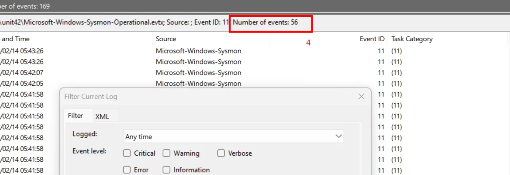
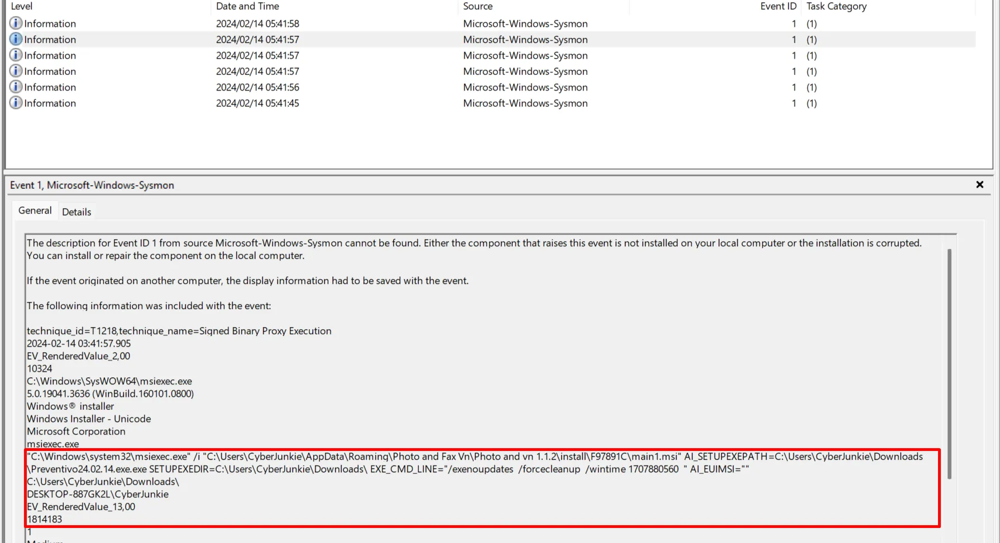
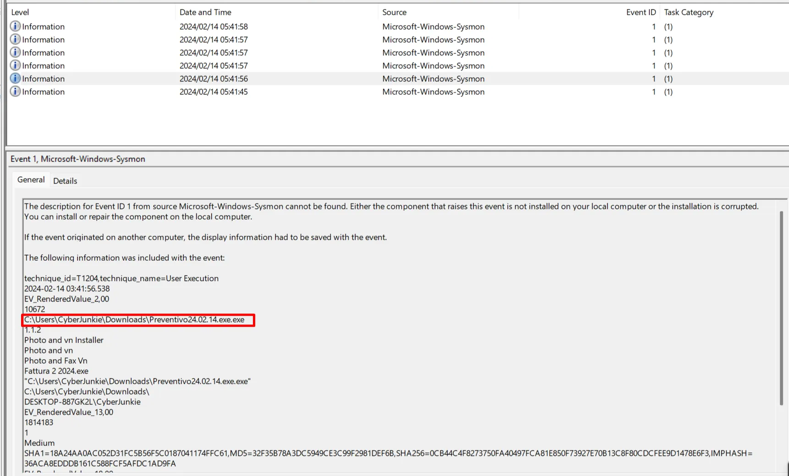
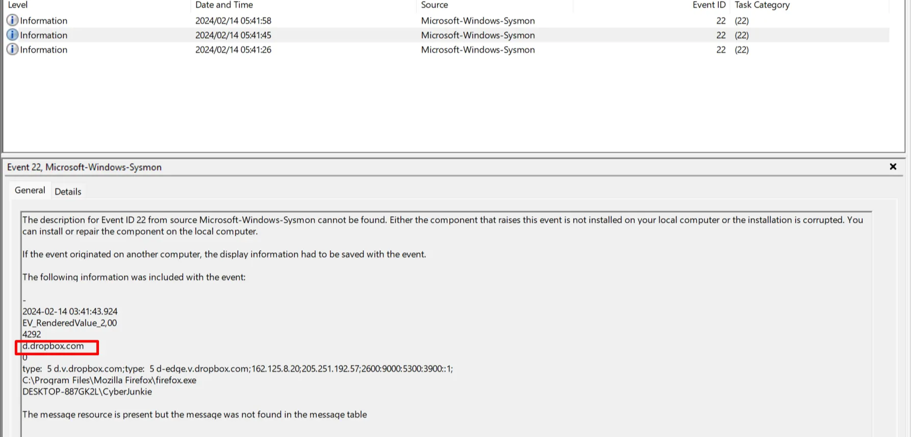
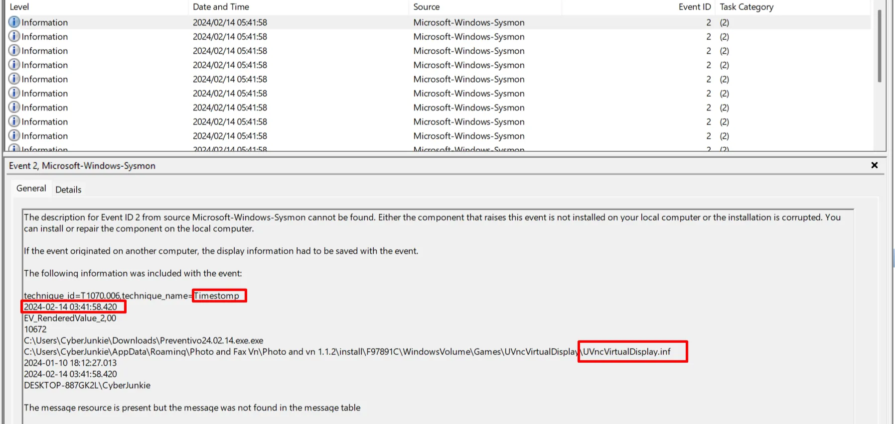
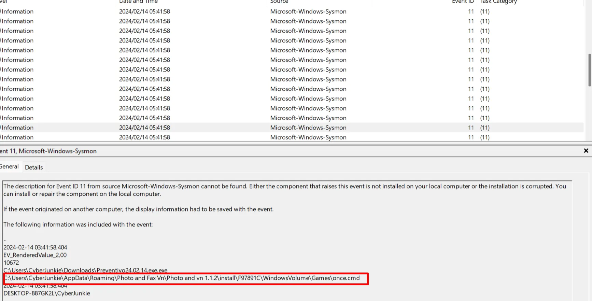
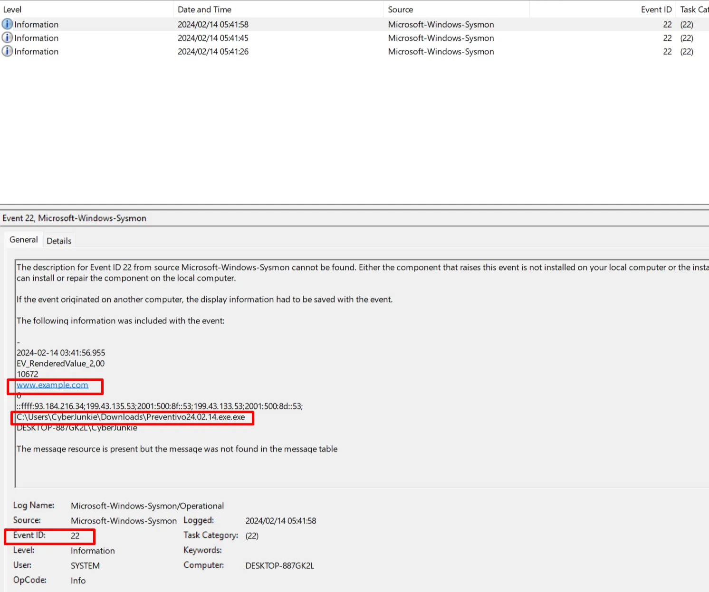
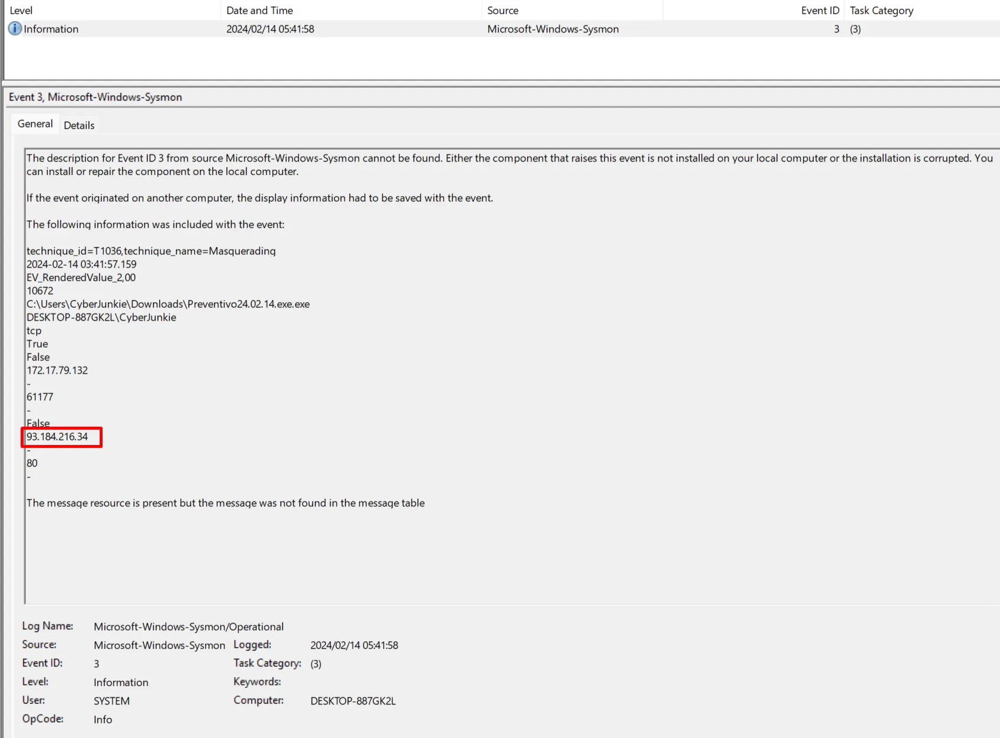
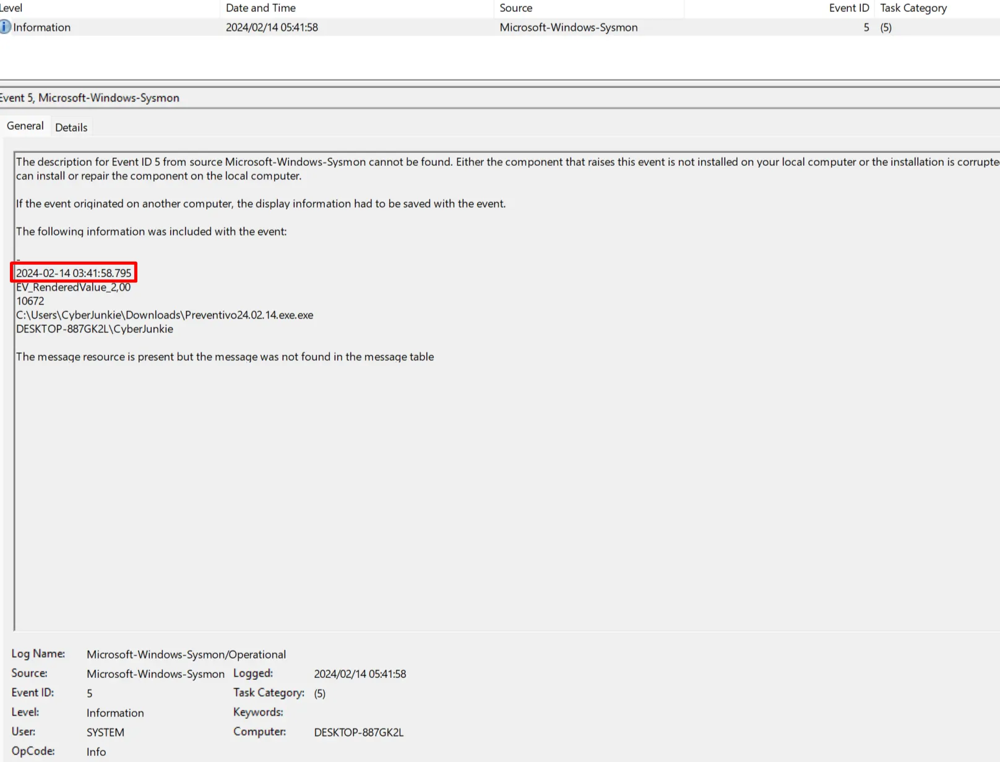

# Introduction

In this investigation, we familiarize ourselves with key Sysmon Event IDs and how they can be used to detect and analyse malicious activity on a Windows system. The scenario is inspired by Unit 42 (Palo Alto Networks) research into an UltraVNC campaign, where attackers deployed a backdoored version of UltraVNC to maintain persistence. This lab guides you through the initial access stage of that campaign, using a single Sysmon log file as evidence.

# Investigation

### Task 1: How many Event logs are there with Event ID 11? 
Answer: 56

With only one log file provided, we open the artifact and simply count the number of events where EventID=11. There are 56 such events, meaning the system recorded 56 file creations during the observed timeframe.

Fig. 1 – General view of the log set (Windows Defender real-time protection status for context).

### Task 2: What is the malicious process that infected the victim's system?

Answer: C:\Users\CyberJunkie\Downloads\Preventivo24.02.14.exe.exe

Whenever a process spawns, Sysmon logs it with Event ID 1, capturing the full command line, hashes, process path, and parent process path. This is invaluable for spotting suspicious executions.

Filtering for Event ID 1, we see a process creation in the user’s Downloads folder with a double .exe.exe extension – a common masquerading trick. The second entry from the top clearly shows Preventivo24.02.14.exe.exe being launched.

Fig. 2 – Event ID 1 listing; the malicious process appears as the second record.

A further process recorded at the fifth log entry provides additional context of the infection chain.

Fig. 3 – Another process creation event tied to the malware.

### Task 3: Which Cloud drive was used to distribute the malware?

Answer: dropbox

DNS query logs (Event ID 22) reveal domains the system attempted to resolve. By inspecting these queries, we can see where the initial payload was hosted. The domain dropbox.com (or a related subdomain) appears in the DNS logs, indicating Dropbox was the delivery platform.

Fig. 4 – Event ID 22 showing DNS queries, including the cloud storage service.

### Task 4: where the file creation date is changed to make it appear older and blend in with other files. What was the timestamp changed to for the PDF file?

Answer: 2024-01-14 08:10:06

Event ID 2 captures file creation time changes, recording the original timestamp, the altered timestamp, and the process responsible. After filtering for Event ID 2, we locate the PDF modification entry and convert the logged time to UTC, yielding 2024-01-14 08:10:06.

Fig. 5 – File creation time change event with the tampered timestamp.

### Task 5: The malicious file dropped a few files on disk. Where was "once.cmd" created on disk? Please answer with the full path along with the filename.

Answer:
C:\Users\CyberJunkie\AppData\Roaming\Photo and Fax Vn\Photo and vn 1.1.2\install\F97891C\WindowsVolume\Games\once.cmd

Event ID 11 logs file creation. Applying a filter for EventID=11 and searching for once.cmd reveals the full path shown above.

Fig. 6 – File creation event disclosing the full path of once.cmd.

### Task 6: The malicious file attempted to reach a dummy domain, most likely to check the internet connection status. What domain name did it try to connect to?

Answer: www.example.com

Looking again at the DNS queries (Event ID 22), we spot a resolution attempt for www.example.com, a well-known placeholder used for connectivity tests.

Fig. 7 – DNS query showing www.example.com.

### Task 7: Which IP address did the malicious process try to reach out to?

Answer: 93.184.216.34

Event ID 3 records network connections, including source process, destination IP, and port. Filtering for EventID=3 and examining the entries related to our malware, we find a connection attempt to 93.184.216.34 (the IP resolves back to example.com).

Fig. 8 – Outbound network connection logged as Event ID 3.

### Task 8: The malicious process terminated itself after infecting the pc with UltraVnc backdoored variant. When did the process terminated itself?

Answer: 2024-02-14 03:41:58

Event ID 5 indicates a process termination. Filtering for this ID and locating the terminating process (the initial dropper) provides the exact timestamp: 2024-02-14 03:41:58.

Fig. 9 – Event ID 5 with the termination timestamp of the malware process.

# Conclusion
By systematically examining process creation, file system modifications, network connections, and DNS queries, we pieced together the infection timeline from a single Sysmon log file. The attacker used a double-extension executable hosted on Dropbox, dropped a backdoored UltraVNC installer, employed timestomping to evade detection, and performed a connectivity check against example.com. This lab illustrates the power of Windows endpoint logging in incident response and forensics.